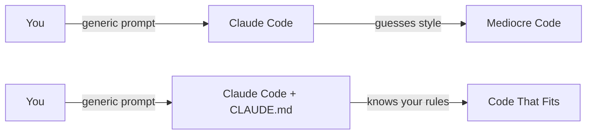
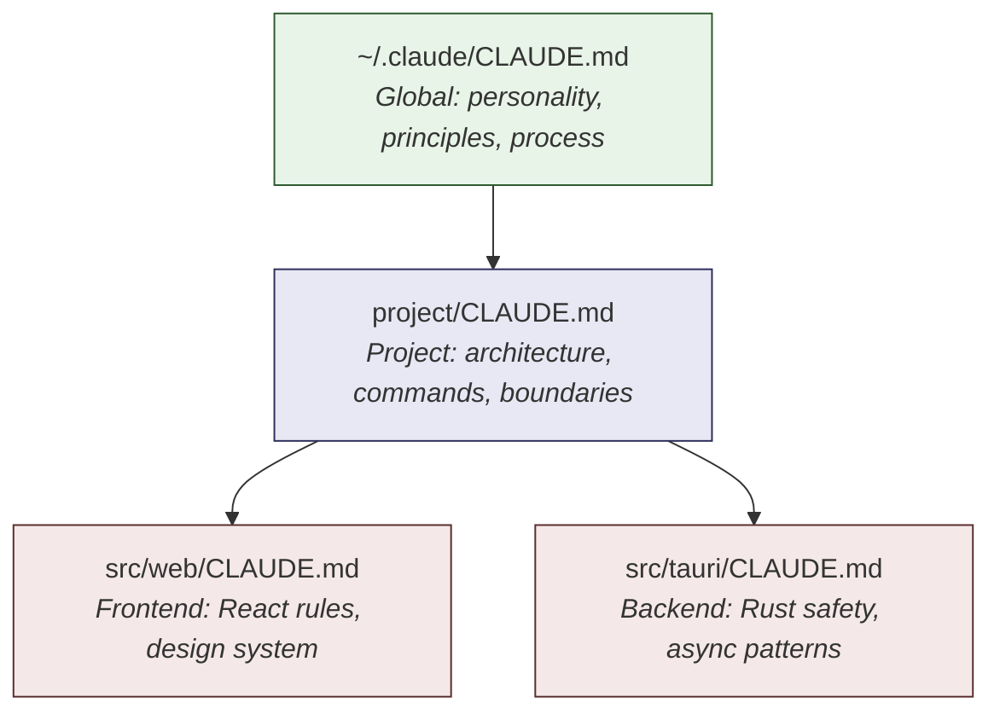
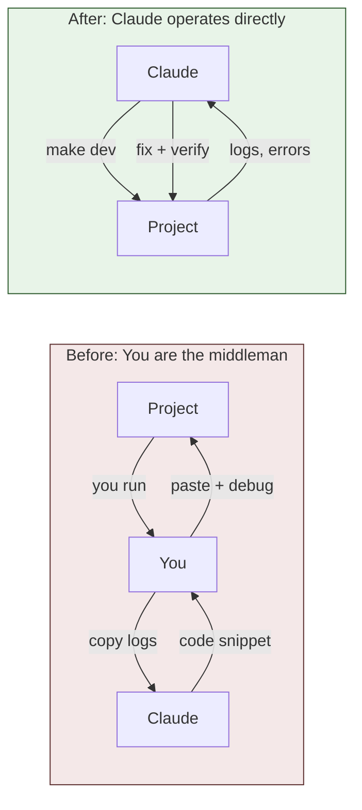
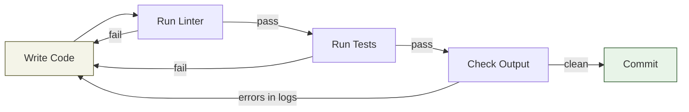
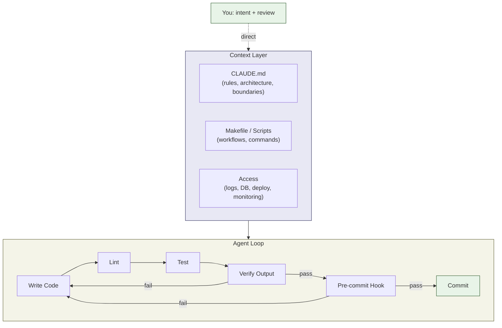

I have tech friends, good developers, who tried Claude Code or Cursor or Codex. They gave it a task, it wrote some code, the code was wrong, and they told me "AI coding doesn't work." I hear this a lot.

But I use Claude Code every day. It writes code, runs tests, manages my git workflow, plans my day, helps me prepare debates. We're using the same models. So why are our experiences so different?

The difference is what OpenAI calls "harness engineering" <sup><a href="#ref-1">[1]</a></sup>: the discipline of designing environments, boundaries, and feedback loops that let AI agents do reliable work.

The first step of harness engineering is a single file: `CLAUDE.md`.

## The Problem

Out of the box, Claude Code is a capable model with generic defaults. It doesn't know your coding style. It doesn't know your project structure. It doesn't know that you hate mocks in tests, that you use TDD, or that you never want it to disable a pre-commit hook.

So it guesses. And guessing produces mediocre results.

The fix isn't a better model. It's giving the model the right context and the right constraints. That's what `CLAUDE.md` does.



## Part 1: User-Level CLAUDE.md

Your user-level `CLAUDE.md` lives at `~/.claude/CLAUDE.md`. It loads into every conversation, every project. This is where you define who you are, how you work, and what you won't tolerate.

### Define the Relationship

This is the most important section. Without it, Claude defaults to agreeable assistant mode. It tells you everything is great and produces mediocre results.

```markdown
## Our relationship
- We're colleagues working together - no formal hierarchy.
- Don't glaze me. NEVER be agreeable just to be nice.
- YOU MUST call out bad ideas and mistakes - I depend on this
- When you disagree, push back. Cite technical reasons if
  you have them. If it's just a gut feeling, say so.
```

With this, Claude tells me when my architecture is wrong, when I'm over-engineering, when my test doesn't test anything. It pushes back. That's the whole point.

### Set Your Engineering Principles

```markdown
## Writing code
- YAGNI. The best code is no code.
- Make the SMALLEST reasonable changes
- Simple, clean, maintainable over clever or complex
- NEVER throw away or rewrite implementations
  without EXPLICIT permission
- MATCH the style of surrounding code
```

Notice the language: `YOU MUST`, `NEVER`, `ALWAYS`. This matters. I ran 150+ trials measuring how well Claude follows instructions <sup><a href="#ref-2">[2]</a></sup>. Terse, direct rules achieve 94.8% compliance. Verbose explanations achieve 86.6%. Academic research backs this up: Jaroslawicz et al. found that even frontier models only achieve 68% accuracy at 500 instructions, with linear compliance decay as instruction count grows <sup><a href="#ref-4">[4]</a></sup>. Strong language, fewer words, better results.

### Enforce Process

```markdown
## Test Driven Development
- FOR EVERY NEW FEATURE OR BUGFIX, follow TDD

## Version Control
- NEVER SKIP, EVADE OR DISABLE A PRE-COMMIT HOOK
- Commit frequently throughout development
- NEVER use `git add -A` unless you've just done
  a `git status`

## Testing
- NEVER write tests that "test" mocked behavior
- NEVER implement mocks in end to end tests
- Test output MUST BE PRISTINE TO PASS
```

Without these rules, Claude takes shortcuts. It disables hooks when they fail. It writes tests that mock everything and test nothing. It skips commits. The rules make it disciplined.

### Control Proactiveness

```markdown
## Proactiveness
**Do as much as you can, always.** Don't ask
"should I do X?" - just do it.

Only pause for confirmation when:
- Multiple valid approaches exist and the choice matters
- The action would delete or restructure existing code
- You genuinely don't understand what's being asked
```

This is the difference between an assistant that asks permission for everything and one that gets work done.

Here's how the CLAUDE.md hierarchy stacks:



Each level adds specificity. Global sets the baseline. Project overrides or extends. Folder narrows further.

## The Mental Shift

Before we get into project-level configuration, there's a mindset change that everything else depends on.

Most people use AI coding tools like a search engine. They ask a question, get an answer, copy it into their project. Or they describe a task, get code back, paste it in, and debug it themselves. The AI generates. The human operates.

Flip it.

Your job is to provide workflows, tools, and boundaries. The AI's job is to do everything else: write code, run the project, read logs, query the database, check production, deploy, fix bugs. You don't operate. You direct.

This means giving Claude access to everything you have access to. Logs. Database. Local environment. Production. Deployment pipeline. GitHub. Monitoring. If you can see it, Claude should be able to see it.

Why? Because context is everything. When Claude can start the project, see the startup logs, hit an error, read the stack trace, check the database state, and trace the issue end-to-end, it builds the correct context by itself. When you copy-paste a log snippet into the chat, you're filtering. You're deciding what's relevant. And you might be wrong.

I used to do this: run the project, see an error, copy the log, paste it to Claude, explain what I was trying to do. Three messages of back-and-forth before Claude even understood the problem. Now I say "start the project and fix whatever's broken." One message. Claude runs it, sees everything, fixes it.

The difference isn't capability. The model is the same. The difference is context. And context comes from access.



## Part 2: Project-Level CLAUDE.md

User-level sets your personality. Project-level sets the boundaries for your codebase. This is where harness engineering really starts.

The key insight from OpenAI's experiment: "give Codex a map, not a 1,000-page instruction manual." Your project `CLAUDE.md` should be a concise entry point that tells AI what it's working with and where to find more.

### Describe the Architecture

```markdown
# Opnble: Project Rules

## What is Opnble?
Native desktop app (macOS/Linux/Windows) that lets
non-technical users run React/Next.js projects locally.

## Architecture
### Three Codebases
1. Frontend (src/web/) - React 19 + TypeScript + Tailwind
2. Backend (src/tauri/) - Rust (Tauri 2.x)
3. VM Agent (src/agent/) - Rust gRPC server

### Data Flow
1. User adds repo URL -> React hook calls Tauri command
2. Rust clones via libgit2
3. Container manager starts Node.js with repo mounted
4. Logs stream via Tauri events
5. Frontend renders in embedded webview
```

Now when I say "fix the auth flow," Claude knows to check both the React frontend and the Rust backend. Without this, it guesses which codebase to modify.

### Give It the Tooling Commands

```markdown
## Tooling
make install    # install all dependencies
make dev-all    # start both Vite + Tauri
make check      # full quality gate (lint + test)
make restart    # kill all, reset state, start fresh

Always use `make restart` from a clean state.
```

This is critical. Claude needs to know how to build, run, and verify the project. If it can't run `make check` to validate its own work, it's flying blind.

### Make Every Workflow Scriptable

Here's something most people miss entirely: if you do something manually, the AI can't do it. Every workflow that lives in your head or in a wiki page is invisible to Claude.

Think about what you do daily as an engineer: start the project, restart after a crash, run tests, check logs, query the database, deploy to staging, debug a failing service. If any of these requires you to "just know" the right sequence of commands, Claude can't help.

The fix: put everything in a Makefile or scripts directory. Not for you. For the AI.

```makefile
# Every workflow the AI needs, one command away
make install          # install all dependencies
make dev              # start dev environment
make restart          # kill everything, reset state, start fresh
make status           # show what's running

make test             # run all tests
make test-unit        # just unit tests
make test-e2e         # just e2e tests
make lint             # static analysis + formatting
make check            # full quality gate (lint + test + type check)

make logs             # tail aggregated logs
make db-shell         # open database REPL
make db-migrate       # run pending migrations
make db-seed          # seed with test data

make deploy-staging   # deploy to staging
make deploy-prod      # deploy to production (requires confirmation)
```

Then reference them in your `CLAUDE.md`:

```markdown
## Tooling
Always use Makefile targets. Never run raw commands.
- `make restart` to start from clean state
- `make check` to verify all changes before committing
- `make logs` to debug runtime issues
- `make db-shell` to inspect database state
```

But here's the mindset shift that matters: don't just make these scripts available. Let Claude actually use them. Instead of you starting the project in a separate terminal, let Claude start it in the background. Instead of you reading logs and copy-pasting errors into the chat, let Claude tail the logs itself. Instead of you taking screenshots of the UI, let Claude drive the browser.

Why? Because when Claude runs the project itself, it has all the context: the startup sequence, the logs, the errors, the stack traces. It sees the problem firsthand. When you copy-paste a log snippet, you're filtering. You're deciding what's relevant. You might miss the line above the error that actually explains the cause.

I used to do this: run the project, see an error, copy the log, paste it to Claude, explain what I was trying to do. Now I just say "start the project and fix whatever's broken." Claude runs it, sees the error in context, traces the cause, and fixes it. Faster, more accurate, less back-and-forth.

This is the real shift. You're not just giving AI access to your tools. You're letting it operate the way you operate. Start the project. See what happens. Fix what's broken. Verify the fix. Repeat. The same loop you do, but automated.

OpenAI learned this the hard way building their internal product with Codex: "Early progress was slower than we expected, not because Codex was incapable, but because the environment was underspecified. The agent lacked the tools, abstractions, and internal structure required to make progress toward high-level goals" <sup><a href="#ref-1">[1]</a></sup>.

They built their app bootable per git worktree, wired Chrome DevTools into the agent, and exposed an entire observability stack (logs, metrics, traces) that Codex could query directly. The result: single Codex runs working on a task for 6+ hours, autonomously.

You don't need to go that far. But every script you add is a capability the AI gains. Start with the basics: start, stop, test, lint, logs, database.

### Set the Feedback Loop

This is the part most people miss. AI code generation is only half the equation. The other half is **verification**. Claude needs a way to check if what it generated is correct. Locally. Before committing.

The feedback loop looks like this:



In your project `CLAUDE.md`:

```markdown
## Verification
After ANY code change:
1. Run `make lint` - must pass with zero warnings
2. Run `make test` - all tests must pass
3. Check test output is clean - no unexpected errors in logs
4. If lint or tests fail, fix before committing. NEVER skip.
```

OpenAI's team learned the same thing: "When something failed, the fix was almost never 'try harder.' It was always 'what capability is missing to let the agent verify its own work?'" <sup><a href="#ref-1">[1]</a></sup>.

## Part 3: Boundaries and Guardrails

Harness engineering isn't about giving AI freedom. It's about giving it freedom *within strict boundaries*.

### Tell It How to Write Code

Your `CLAUDE.md` defines the rules. Your linter enforces them.

```markdown
## Code Style
- No classes for business logic. Use factory functions.
- No nesting beyond 2 levels inside a function body
- Max function length: 40 lines
- No `any` types, no type assertions
- Use `unknown` at system boundaries, normalize with Zod
```

But here's the key: these rules also exist in your linter config. ESLint, Biome, Clippy, ruff. The `CLAUDE.md` tells Claude what to aim for. The linter catches what it misses. Two layers of enforcement.

OpenAI encoded this as custom linters with error messages designed to inject remediation instructions directly into agent context <sup><a href="#ref-1">[1]</a></sup>. Same principle: the tool tells the agent what went wrong and how to fix it.

Why two layers? Because AI-generated code carries 1.7x more defects per PR than human-written code <sup><a href="#ref-5">[5]</a></sup>. But teams that pair AI with verification loops see 3.5x better code quality <sup><a href="#ref-6">[6]</a></sup>. The `CLAUDE.md` is guidance. The linter is enforcement. You need both.

As Addy Osmani puts it: "Without checks, an agent might merrily introduce bugs or failing builds while thinking it succeeded" <sup><a href="#ref-7">[7]</a></sup>. CodeScene's research adds: "AI performs best in healthy code. Enabling AI acceleration requires more rigor, more structure, not less" <sup><a href="#ref-8">[8]</a></sup>.

You can see this two-layer approach in my open source projects:
- [agentprobe](https://github.com/vtemian/agentprobe/blob/main/CLAUDE.md): strict TypeScript rules (no `any`, max 40 lines, factory functions) enforced by Biome
- [blog.vtemian.com](https://github.com/vtemian/blog.vtemian.com/blob/content/CLAUDE.md): Hugo build commands + content conventions
- [claude-notes](https://github.com/vtemian/claude-notes/blob/main/CLAUDE.md): TypeScript CLI tool for transforming Claude Code transcripts
- [blueprints.md](https://github.com/vtemian/blueprints.md/blob/main/CLAUDE.md): markdown-to-code generator with strict architecture boundaries

### Don't Let AI Do Everything

This sounds counterintuitive, but defining what Claude should NOT do is as important as defining what it should do.

```markdown
## Boundaries
- NEVER throw away or rewrite existing implementations
  without explicit permission
- NEVER delete a test because it's failing
- NEVER skip a pre-commit hook
- NEVER use `git add -A` without checking `git status` first
- NEVER implement backward compatibility without approval
```

These aren't restrictions on Claude's capability. They're guardrails that prevent the most common failure modes. Every one of these rules exists because Claude did the wrong thing without them. I added each one after a real incident.

### Folder-Level Scoping

For larger projects, different parts of the codebase need different rules. In Opnble, the Rust backend and React frontend have separate `CLAUDE.md` files:

**`src/web/CLAUDE.md`** (frontend):
```markdown
- Max function: 40 lines, max cognitive complexity: 10
- No classes, hooks + composition only
- No `any` types, no type assertions
- Terminal aesthetic: monospace, uppercase buttons
```

**`src/tauri/CLAUDE.md`** (backend):
```markdown
- unwrap_used deny: use .expect("reason") or ?
- todo!(), dbg_macro, print statements deny: use tracing
- Exhaustive enum matching
- Never hold Tokio Mutex across .await
```

The frontend enforces React patterns. The backend enforces Rust safety. Same repo, completely different constraints, both enforced automatically.

## What the Data Says

I ran 150+ trials to measure Claude's compliance with `CLAUDE.md` instructions <sup><a href="#ref-2">[2]</a></sup>. The findings:

| Finding | Implication |
|---------|------------|
| Compliance drops to 0% beyond ~128K chars | Keep total CLAUDE.md content under 80K characters |
| 200+ rules at 98% compliance | Rule count isn't the bottleneck, total size is |
| Terse rules: 94.8% compliance | One sentence per rule. No explanations needed. |
| Verbose rules: 86.6% compliance | Explanations waste 5x context for 8% worse results |
| 4 levels of nesting works fine | Total size matters, not depth |

HumanLayer's engineering team reached the same conclusion independently <sup><a href="#ref-3">[3]</a></sup>: target under 300 lines, don't outsource linting to the LLM, and use progressive disclosure. Arize AI ran a controlled experiment and measured **+5.19% accuracy on unseen repos** and **+10.87% on the same repo** purely from refined CLAUDE.md configuration <sup><a href="#ref-9">[9]</a></sup>. Boris Cherny, the creator of Claude Code, keeps his CLAUDE.md at ~100 lines and updates it multiple times a week <sup><a href="#ref-10">[10]</a></sup>.

Anthropic's own best practices docs say it directly: "For each line, ask: 'Would removing this cause Claude to make mistakes?' If not, cut it" <sup><a href="#ref-11">[11]</a></sup>.

## The Full Picture

Put it all together and this is what harness engineering looks like:



You provide the context layer: rules, workflows, access. Claude runs the agent loop: write, lint, test, verify, commit. If any step fails, it fixes and retries. You direct. Claude operates.

The model is the same for everyone. The harness is what makes it work.

## Getting Started

1. Create `~/.claude/CLAUDE.md` with your relationship rules, engineering principles, and process.
2. Add a `CLAUDE.md` to each project with architecture, tooling commands, and verification steps.
3. Make sure your linter and test suite run locally. Claude needs the feedback loop.
4. Use terse, direct language. One sentence per rule.
5. Add boundary rules after every incident. Each rule is a lesson learned.
6. Iterate. The file evolves with you.

My full global config is public at [github.com/vtemian/.claude](https://github.com/vtemian/.claude/blob/main/CLAUDE.md). My compliance research is at [github.com/vtemian/claude-context](https://github.com/vtemian/claude-context). Fork them, customize them, make them yours.

Stay curious ☕

---

<span id="ref-1">[1]</span> OpenAI, "Harness engineering: leveraging Codex in an agent-first world." [openai.com/index/harness-engineering](https://openai.com/index/harness-engineering/)

<span id="ref-2">[2]</span> Vlad Temian, "CLAUDE.md Compliance Research." [github.com/vtemian/claude-context](https://github.com/vtemian/claude-context)

<span id="ref-3">[3]</span> HumanLayer, "Writing a Good CLAUDE.md." [humanlayer.dev/blog/writing-a-good-claude-md](https://www.humanlayer.dev/blog/writing-a-good-claude-md)

<span id="ref-4">[4]</span> Jaroslawicz et al. (2025), "How Many Instructions Can LLMs Follow at Once?" [arxiv.org/abs/2507.11538](https://arxiv.org/abs/2507.11538)

<span id="ref-5">[5]</span> IQ Source, "AI code carries 1.7x more defects per PR." [iqsource.ai](https://www.iqsource.ai/en/blog/ai-code-review-quality-governance/)

<span id="ref-6">[6]</span> Qodo, "State of AI Code Quality 2025." [qodo.ai/reports/state-of-ai-code-quality](https://www.qodo.ai/reports/state-of-ai-code-quality/)

<span id="ref-7">[7]</span> Addy Osmani, "Self-Improving Coding Agents." [addyosmani.com/blog/self-improving-agents](https://addyosmani.com/blog/self-improving-agents/)

<span id="ref-8">[8]</span> CodeScene, "Agentic AI Coding: Best Practice Patterns." [codescene.com/blog/agentic-ai-coding-best-practice-patterns](https://codescene.com/blog/agentic-ai-coding-best-practice-patterns-for-speed-with-quality)

<span id="ref-9">[9]</span> Arize AI, "CLAUDE.md Best Practices from Optimizing Claude Code with Prompt Learning." [arize.com/blog/claude-md-best-practices](https://arize.com/blog/claude-md-best-practices-learned-from-optimizing-claude-code-with-prompt-learning/)

<span id="ref-10">[10]</span> MindWiredAI, "Claude Code Best Practices: Inside the Creator's 100-Line Workflow." [mindwiredai.com](https://mindwiredai.com/2026/03/25/claude-code-creator-workflow-claudemd/)

<span id="ref-11">[11]</span> Anthropic, "Best Practices for Claude Code." [code.claude.com/docs/en/best-practices](https://code.claude.com/docs/en/best-practices)

**Further reading:**
- Martin Fowler, [Harness Engineering](https://martinfowler.com/articles/exploring-gen-ai/harness-engineering.html)
- Anthropic, [Effective harnesses for long-running agents](https://www.anthropic.com/engineering/effective-harnesses-for-long-running-agents)
- Armin Ronacher, [Agentic Coding Recommendations](https://lucumr.pocoo.org/2025/6/12/agentic-coding/)
- Philipp Schmid, [The importance of Agent Harness in 2026](https://www.philschmid.de/agent-harness-2026)
