In the last couple of years, we have seen the rise of [infrastructure](https://www.shoal.gg/p/parallel-execution-the-next-generation) projects in the blockchain space. One exciting development is [parallel blockchains](https://www.recvc.com/part-i-design-space-for-parallel-blockchains/), specifically those that execute a batch of transactions in parallel.

## Concurrency at Scale

When studying those chains, you can see some parallels to classical [concurrency patterns](https://en.wikipedia.org/wiki/Concurrency_control), but those are hard to implement at scale.
Why is that? In addition to executing transactions in parallel (happening at the VM layer), we also need to consider replicating their output across the network.

Let's explain the problem in a little more detail. We have this distributed state across multiple nodes. We don't sync this state as it is but use state transitions. We need to [replicate state transitions](https://en.wikipedia.org/wiki/State_machine_replication) over the network.

Those state transitions take the form of transactions bundled together in a [block](https://en.wikipedia.org/wiki/Blockchain#Blocks). A node bundles that block, then distributed and validated by other nodes. Once validated, each node mutates its local state by running [transactions](https://en.wikipedia.org/wiki/Transaction_processing).

We'll have a blockchain if we chain those bundles of state transitions. Those state transitions can be quite complex since we can run arbitrary code using arbitrary input data and generating arbitrary output data.

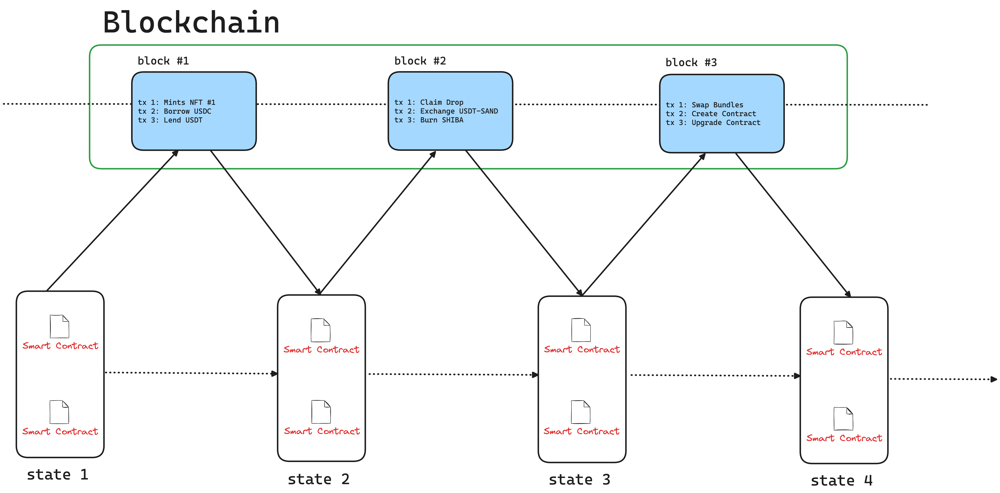

We must be careful which transactions can be executed in parallel because we want to execute multiple transactions in parallel and replicate them across the network. Multiple transactions can be executed in parallel if they don’t mutate the same state in the same execution cycle.

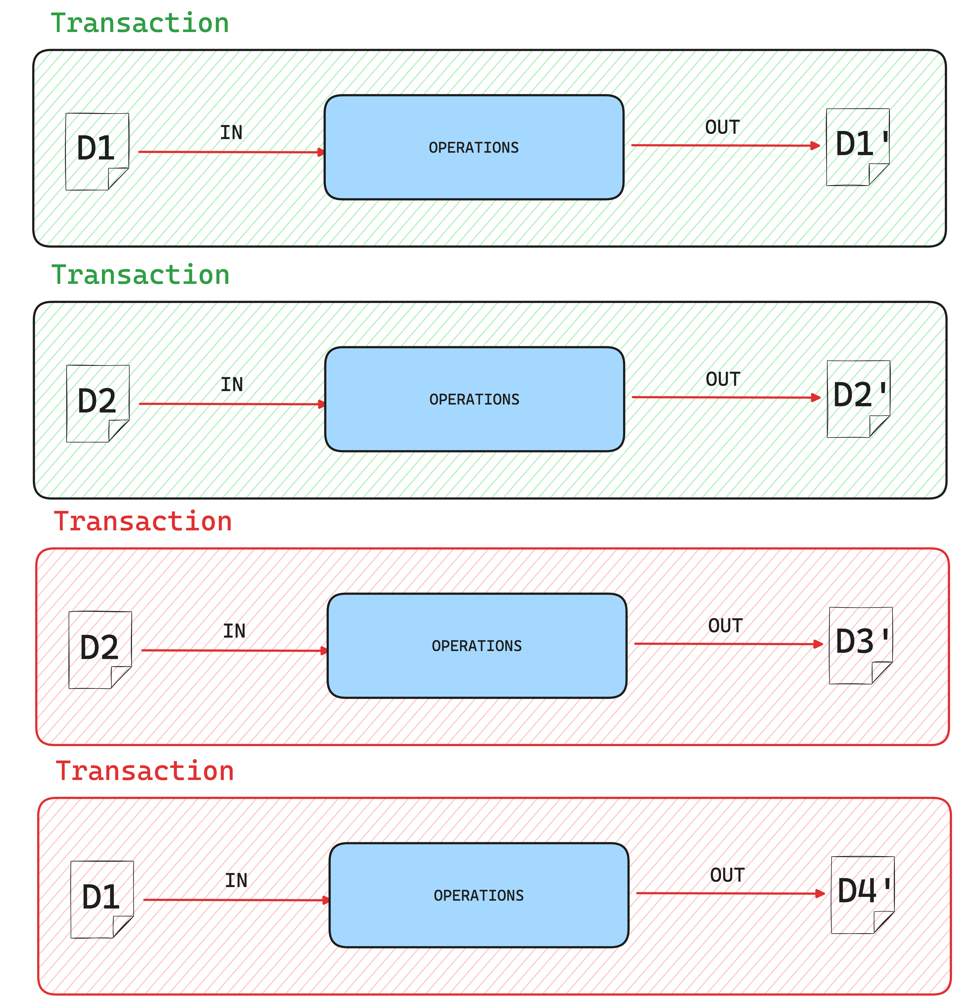

Given this, state access will be the key to running transactions in parallel safely. 

## Deterministic vs Optimistic

There are two principal schools of thought when discussing state access and parallel blockchain execution: [deterministic](https://en.wikipedia.org/wiki/Deterministic_algorithm) vs [optimistic](https://en.wikipedia.org/wiki/Optimistic_concurrency_control) execution.

### Deterministic Execution

In deterministic execution, we expect the same result if we run multiple parallel transactions multiple times in different orders. We call this process deterministic because we expect the same result each time.
How can this be achieved? We need to know before execution what data each transaction will use.
It adds multiple data overhead since we might need to write our smart contracts so that the used data is described in the transaction’s header. Also, we might de-normalize the data, handling complex data structures that might be harder to scale.

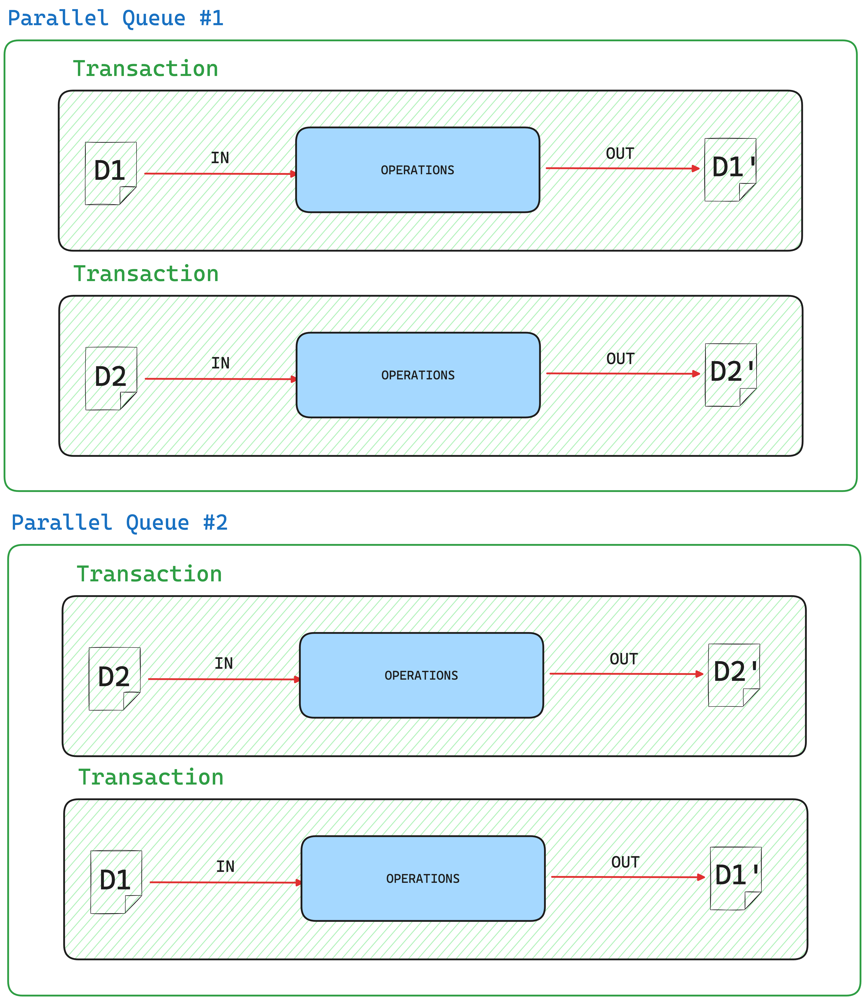

### Solana

Each Solana transaction contains the [“accounts”](https://solana.com/docs/core/accounts) field, in which an array of accounts used while processing transactions is specified. Accounts are data slots separate from the [program](https://www.quicknode.com/guides/solana-development/getting-started/an-introduction-to-the-solana-account-model) (smart contract) and owned by an address. The entire state comprises ownable accounts, and programs are isolated and don’t contain any account data.
That’s different from EVM, where your smart contract has the business logic and the storage used. It contains the state and state transitions, all in one piece.

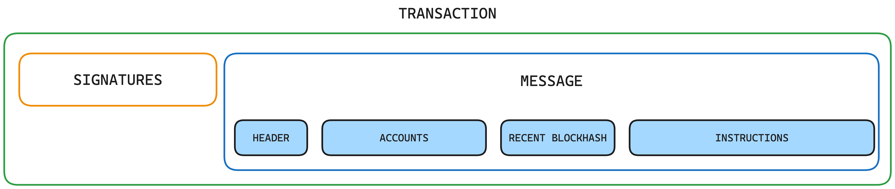

Once we know what data will be used, we can group transactions that do not use duplicate accounts and run them in [parallel](https://medium.com/solana-labs/sealevel-parallel-processing-thousands-of-smart-contracts-d814b378192). 

Another strong point for Solana when executing transactions is the use of [pipelining](https://medium.com/solana-labs/pipelining-in-solana-the-transaction-processing-unit-2bb01dbd2d8f). The Sealevel VM can Fetch, Verify Signatures, Bank, and Write in parallel. Other blockchains have also implemented this architecture.

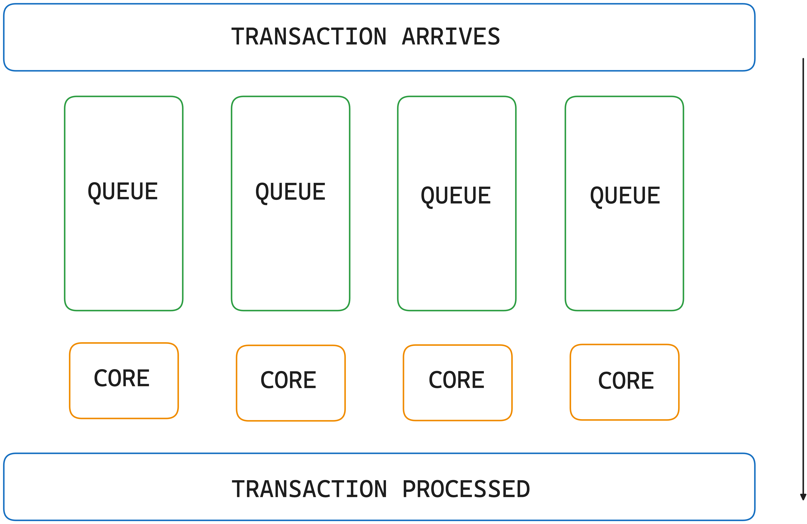

Of course, it is all about trade-offs. There’s no silver bullet. This accounting approach adds overhead for transaction building, validating, and executions. Also, the overall complexity of data management is increasing exponentially.

|                 |    *Solana*   |
| --------------- | ------------- |
| Parallelization | Deterministic |
| State Access | AccountsDB |
| Virtual Machine | SVM Multi-threaded |
| Max Recorded TPS| 7229 tx/s |
| Max Theoretical TSP| 65000 tx/s |
------------------------------------

### SUI

Instead of using this replicated state machine, SUI thinks slightly differently about state management. For SUI, everything related to data is an ownable [object](https://docs.sui.io/concepts/object-model). If you want to mutate data, you can simply change its ownership. Even smart contracts are objects that can manipulate other objects.

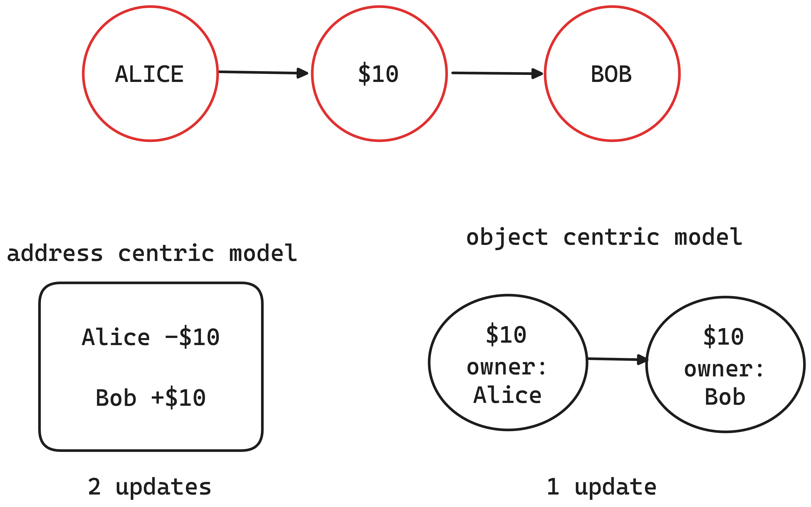

[Transactions](https://docs.sui.io/concepts/transactions) on SUI take some objects as input and produce other mutated or fresh objects. Each object knows the last transaction that made them, forming a [DAG](https://docs.sui.io/concepts/object-model#the-transaction-object-dag-relating-objects-and-transactions) (direct acyclic graph) where each transaction is a node and directed edges are between transactions if the output object of the source transaction is the input object of the destination transaction.

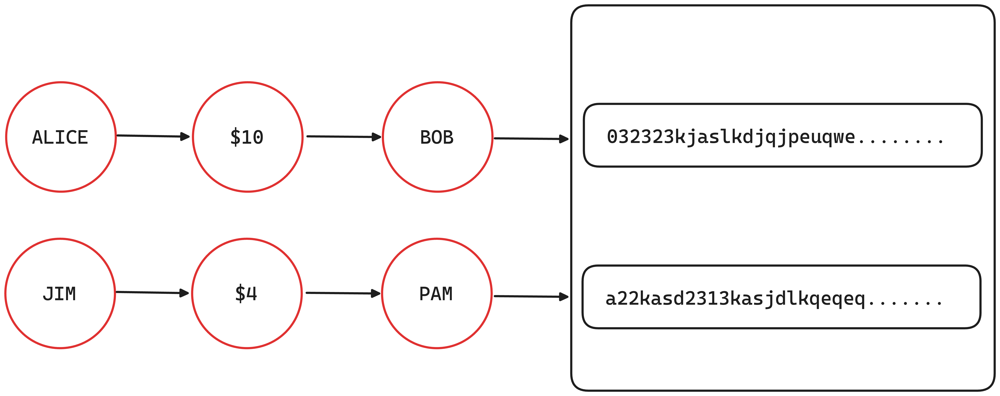

We can run multiple transactions in [parallel](https://blog.sui.io/parallelization-explained/) without conflicts because there is already a clear separation between states that need to be updated, and each object is independent of the others.

|                 |    *Sui*   |
| --------------- | ------------- |
| Parallelization | Deterministic |
| State Access | RocksDB |
| Virtual Machine | Move Multi-threaded |
| Max Recorded TPS| 800 tx/s |
| Max Theoretical TSP| 297000 tx/s |
------------------------------------

## Optimistic Execution

Optimistic parallelization is a straightforward and naive approach to the problem: try to execute multiple transactions simultaneously. Pick a winner and re-try the rest if some touch the same memory zone. Repeat until all transactions are processed.

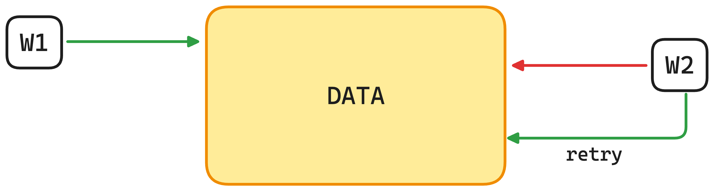

One approach for this optimistic parallelization is an [Optimistic Concurrency Control](https://en.wikipedia.org/wiki/Optimistic_concurrency_control) mechanism, similar to how databases handle transactions. You can implement a transaction statement for each blockchain transaction, execute all state transitions, and validate that another transaction did not alter the data used inside this transaction before committing to the new state.

### SeiV2

SeiV2 is [implementing](https://blog.sei.io/sei-v2-the-first-parallelized-evm/) this OCC mechanism for its EVM transactions. This mechanism draws inspiration from databases, where transactions are processed optimistically, assuming that most will not conflict. In this context, transactions are executed simultaneously, and conflicts are resolved after execution, ensuring that no two transactions modify the same state simultaneously.

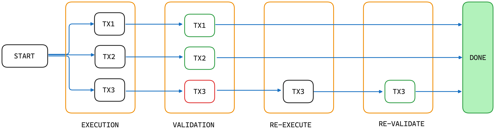

How OCC Works in SeiV2:
* **Parallel Execution**: Multiple transactions are executed in parallel without initially checking whether they conflict. This "optimistic" approach assumes that most transactions will not overlap in the state they modify.
* **Conflict Detection**: After the transactions are executed, SeiV2 checks for conflicts. If two transactions have modified the same state (i.e., touched the same memory zone), one is chosen to be committed, and the others are retried.
* **Transaction Rollback**: If a conflict is detected, conflicting transactions are rolled back and re-executed until all transactions are successfully processed without conflict. This can lead to retries but allows for increased parallel throughput.
* **State Validation Before Commit**: SeiV2 validates that no other transaction has altered the data involved in a given transaction before committing the state changes to the blockchain. If the data has changed, the transaction is retried.

|                 | *SeiV2*             |
| --------------- |---------------------|
| Parallelization | Optimistic          |
| State Access | SeiDB               |
| Virtual Machine | EVM Single-threaded |
| Max Recorded TPS| 256 tx/s            |
| Max Theoretical TSP| 12500 tx/s          |
------------------------------------

### Monad

Monad is another example of L1 that implements optimistic techniques. Their approach is very similar to SeiV2's but not the exact implementation. Besides the optimistic concurrency control and their re-trying mechanism, Monad also has a larger view of how concurrency should behave. 
Before block execution, transactions are [statically analyzed](https://docs.monad.xyz/technical-discussion/execution/parallel-execution#scheduling), and feature dependencies can be detected.

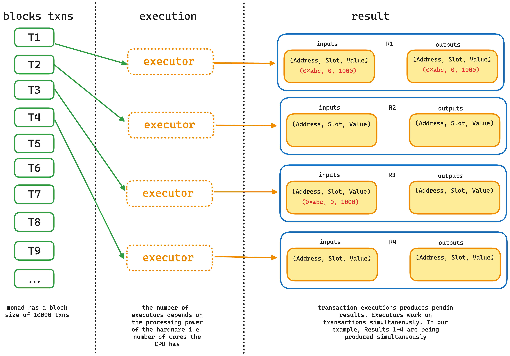

Besides those mechanisms, Monad adds more optimizations to the [execution](https://docs.monad.xyz/technical-discussion/execution/parallel-execution), consensus, and [storage](https://docs.monad.xyz/technical-discussion/execution/monaddb) layers. 

Once you examine how the Ethereum block time is split, you see that much time is spent on [consensus](https://docs.monad.xyz/technical-discussion/consensus/deferred-execution). From a total of 12s block time, we have 120ms on execution. The entire consensus and execution process runs synchronously, which can be optimized. 

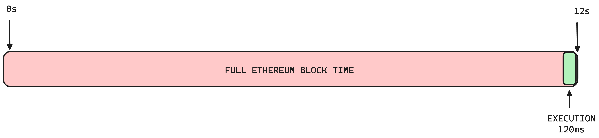

After the consensus phase is finished, you can immediately start with the next consensus phase while, in parallel, running the execution phase. In this way, you can save those wasted 120ms. Now, the trick doesn’t consist of those saved 120ms, but it consists of extending the execution block to match the consensus block, thus allowing more transactions to get executed in the same block time.

Monad adds excellent [pipelining](https://docs.monad.xyz/technical-discussion/concepts/pipelining) features like Solana, allowing for a more streamlined execution. You can use different hardware to prepare the execution part. Instead of waiting for all parts of the execution (FETCH, DECODE, EXECUTE, WRITE) to finish, you can use different cores and hardware to execute them in parallel.

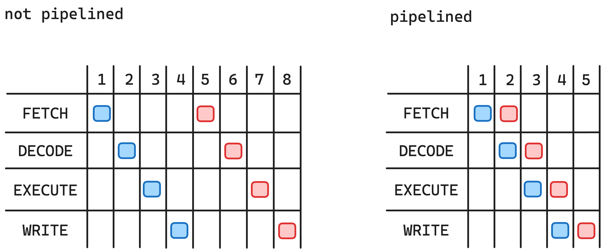

|                 | *Monad*             |
| --------------- |---------------------|
| Parallelization | Optimistic          |
| State Access | MonadDB             |
| Virtual Machine | EVM Single-threaded |
| Max Recorded TPS| 0 tx/s              |
| Max Theoretical TSP| 10000 tx/s          |
------------------------------------

## Block-STM

One of the most significant breakthroughs in optimistic parallelization was the introduction of [block-stm](https://arxiv.org/abs/2203.06871). Block-STM takes its roots in [Software Transactional Memory](https://groups.csail.mit.edu/tds/papers/Shavit/ShavitTouitou-podc95.pdf) (STM), a concurrency technique that makes parallel execution look like sequential execution for developers. You write code that executes in parallel without orchestrating anything. No locks, no semaphores. It adds execution overhead since you need to track all memory access, usually using a multi-version data structure in which you keep all memory’s different states across execution. This allows for fast validation and easier conflict detection.

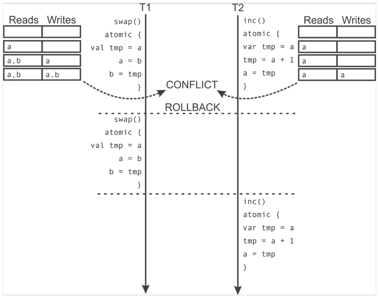

### Aptos

Aptos is one of the [pioneers](https://x.com/Aptos/status/1839379657122345248) who implemented those STM mechanisms at the execution VM layer.
Aptos can build a more efficient re-execution queue using the [multi-version](https://x.com/Aptos/status/1846310188120424899) data structure and OCC since, if you know that one transaction is written in the exact memory location as before, you can stop it and dynamically mark it for retry. They also introduced optimization for scheduling validation and execution tasks on multiple threads using a collaborative scheduler.

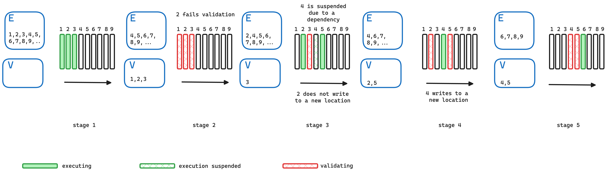

Aptos’ multi-version data structure stores multiple versions of values written by different transactions. When a transaction reads data, it retrieves the highest version written by any preceding transaction in the block. This ensures that reads and writes do not interfere with each other across concurrent transactions. Suppose a transaction needs to be re-executed due to validation failure. In that case, the previous version can be used as an estimate, optimizing dependency tracking and minimizing unnecessary aborts and re-execution.

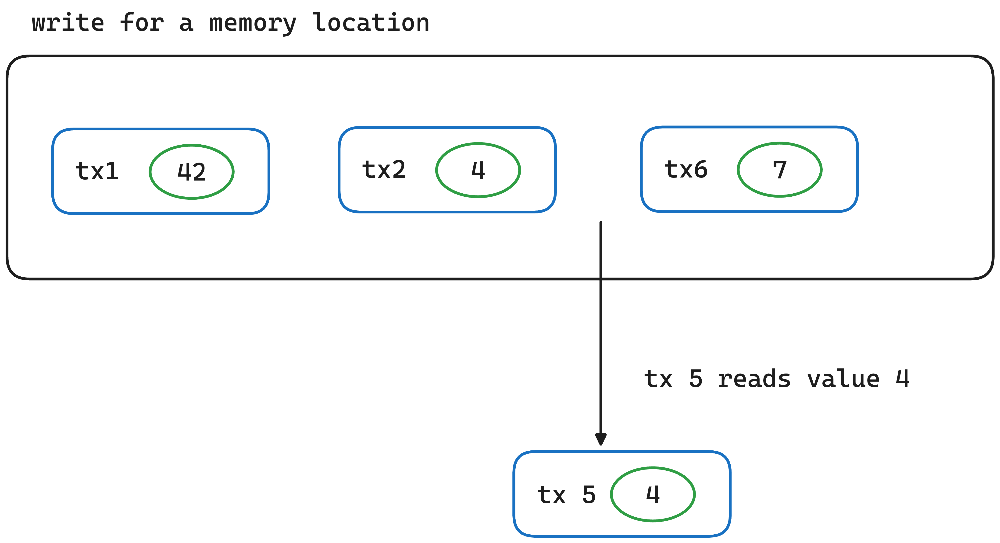

|                 | *Aptos*             |
| --------------- |---------------------|
| Parallelization | Optimistic          |
| State Access | RocksDB             |
| Virtual Machine | Move Multi-threaded |
| Max Recorded TPS| 10734 tx/s          |
| Max Theoretical TSP| 160000 tx/s         |
------------------------------------

## Trade-offs

After exploring the concepts of parallel blockchains and the different approaches to parallelization, it's clear that there are trade-offs and considerations to be made in implementing efficient and safe parallel execution of transactions.

First, deterministic execution, as seen in Solana, requires careful management of data overhead and complex data structures, but it enables running multiple transactions in parallel by grouping those that do not use the same accounts.

On the other hand, SUI's approach to deterministic parallelization emphasizes the clear separation between states that need to be updated, allowing multiple transactions to run in parallel without conflicts.

Optimistic parallelization presents a more straightforward approach, but it requires mechanisms like Optimistic Concurrency Control to handle potential conflicts and ensure data consistency. SeiV2 is implementing such a mechanism for its EVM transactions, drawing inspiration from how databases handle transactions.

Each approach has its trade-offs and implications for data management, transaction validation, and overall complexity. As parallel blockchains continue to evolve, striking a balance between scalability, data integrity, and execution efficiency will remain a crucial consideration.

|                 |    *Solana*   | *Sui*         | *SeiV2*             | *Monad*             | *Aptos*             |
| --------------- | ------------- |---------------|---------------------|---------------------|---------------------|
| Parallelization | Deterministic | Deterministic | Optimistic          | Optimistic          | Optimistic          |
| State Access | AccountsDB | RocksDB | SeiDB               | MonadDB             | RocksDB             |
| Virtual Machine | SVM Multi-threaded | Move Multi-threaded | EVM Single-threaded | EVM Single-threaded | Move Multi-threaded |
| Max Recorded TPS| 7229 tx/s | 800 tx/s | 256 tx/s            | 0 tx/s              | 10734 tx/s          |
| Max Theoretical TSP| 65000 tx/s | 297000 tx/s | 12500 tx/s          | 10000 tx/s          | 160000 tx/s         |
