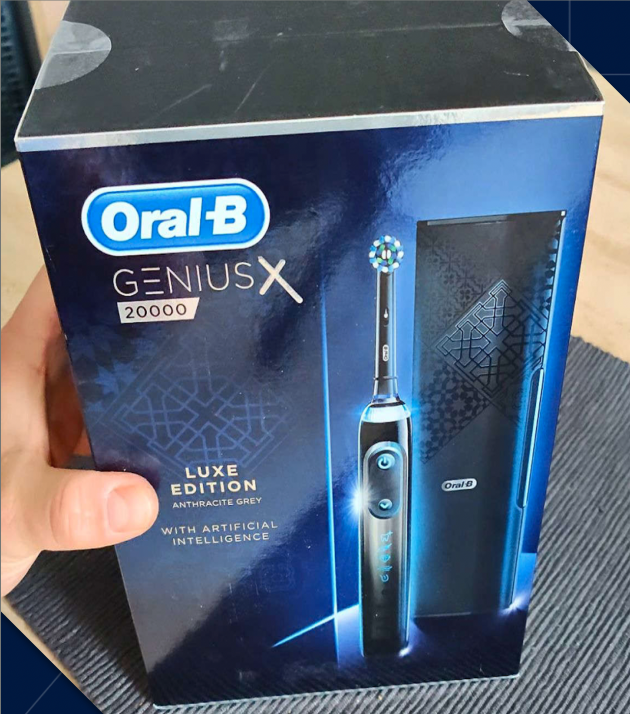
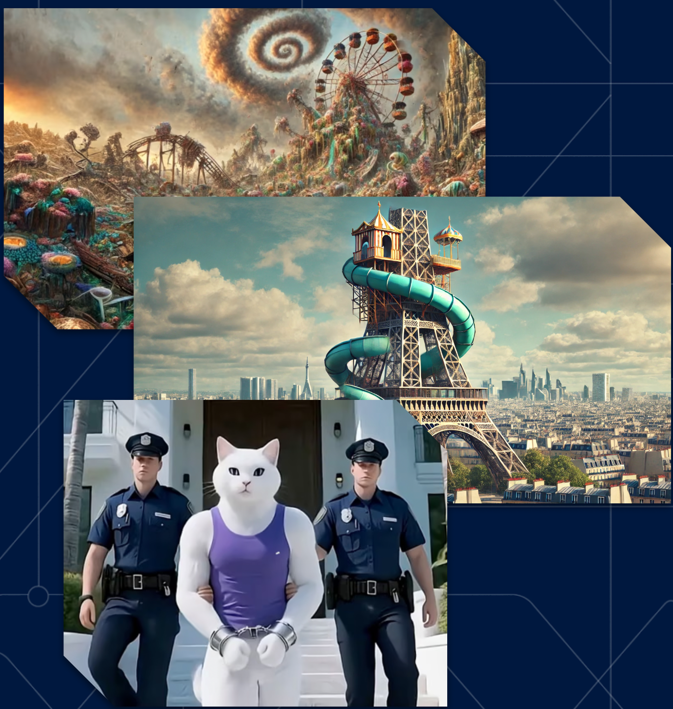
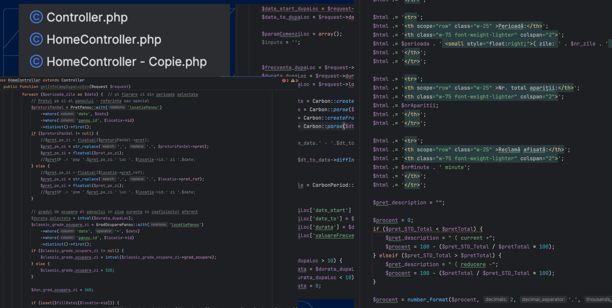
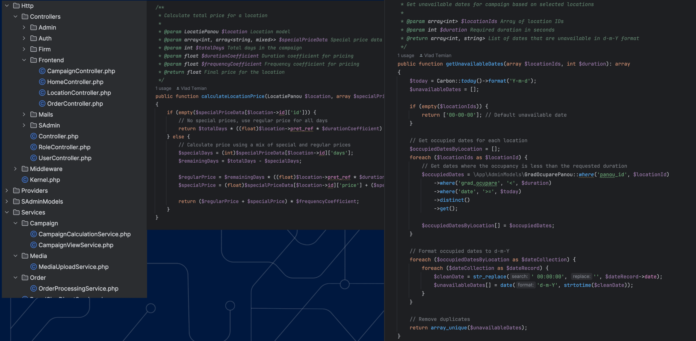
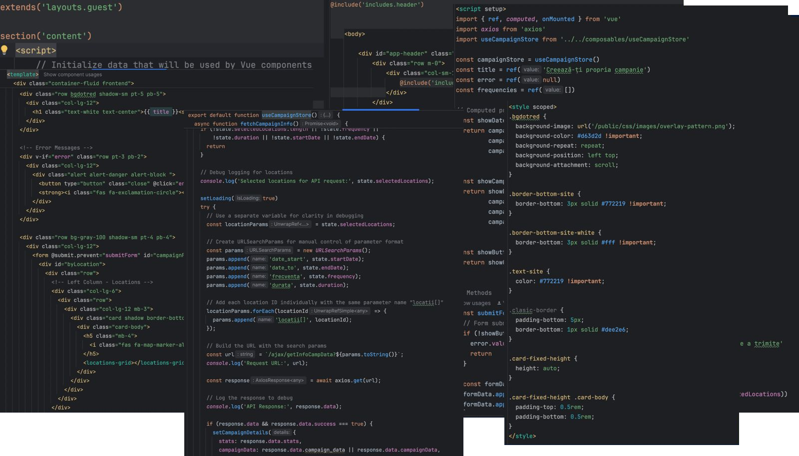
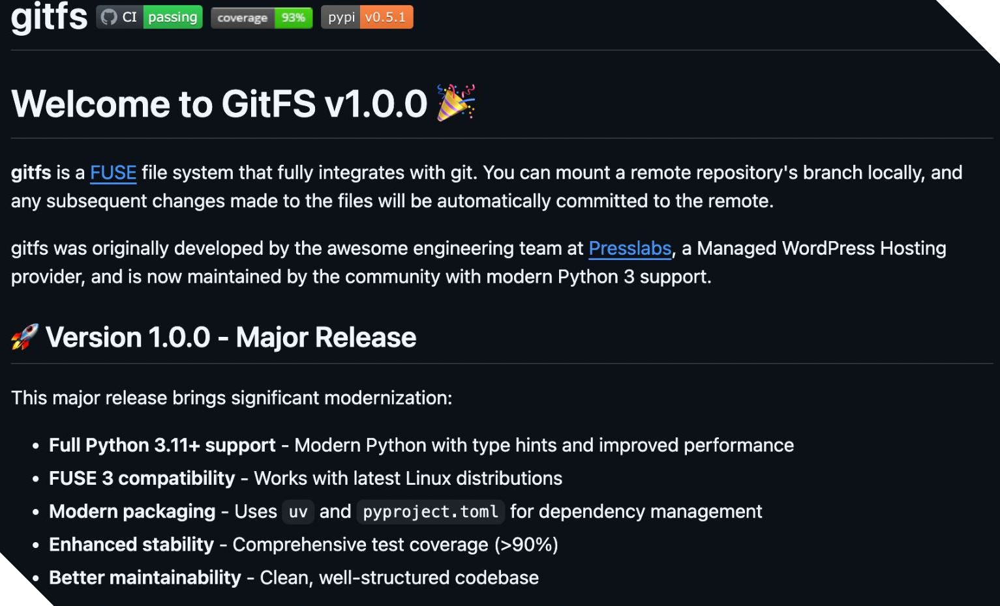
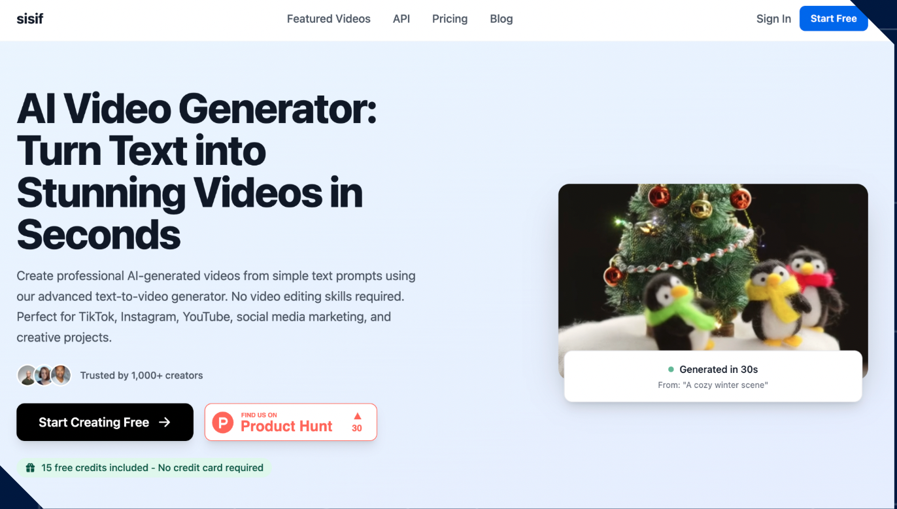
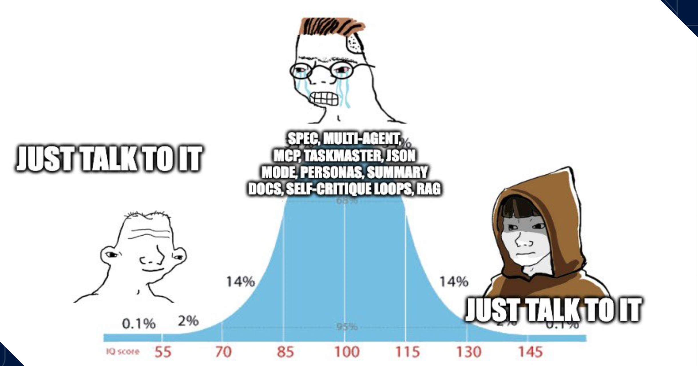

It's hard to write about AI these days without speaking about the elephant in the room. Every single business is pushing AI. We're seeing it everywhere. Google Chrome. Slack. WhatsApp. Even our toothbrushes. A lot of businesses are trying to capitalize on this new tech. And it's raising a negative sentiment.

This negative sentiment is amplified by the **slop**: shitty images, shitty videos, shitty text polluting websites everywhere. It's not just bad for sentiment. It's bad for the entire internet. Worse, this slop affects current AI research: shitty content trains new models, risking a decline in performance over time. But I think we're just following a normal **hype cycle**, similar to others we've seen before. Most recently, blockchain. People get super excited. "AGI is here! Jobs are being replaced! We're doomed forever!" I'm not that pessimistic.

Because beneath all the noise and hype, something real is happening. We see an increase in daily usage. People use AI tools to do productive things. Generating code. Enhancing learning. Navigating legal frameworks. And there's a shift in more personal usage too. Organizing life. Finding purpose. Therapy. My dad uses it to help him with his heat pump. My mom uses it for research on her medical needs. This adoption is facilitated by UX improvements. You can now use voice to talk with ChatGPT. Use video to show your surroundings.

And regarding code? At The Sandbox, more than **75% of the code is generated using AI tools**. Claude Code is 3rd in the number of commits. But even other code not committed by Claude is still generated with it or Copilot. So my take: **AI is here to stay**. Even if we like it or not. Even if there are no new advancements for the models, the current tools are good enough to have a great impact on our lives.

That realization, for me, happened on **March 17th, 2025**. The day I discovered that technical debt isn't the insurmountable mountain we pretend it is. The day I refactored a nightmare codebase in three hours.

***

You know the project. The one nobody wants to touch. It's been making money for years. Users depend on it. But every time someone opens the codebase, they quietly close their laptop and find something else to do. Fat controllers with thousands of lines. Copy-paste logic scattered across dozens of files. Comments in three different languages. jQuery callbacks nested so deep you need a map to find your way out. And the worst part? You can't just rewrite it. It works. It's critical. The business depends on it.

So it sits there. Accumulating technical debt like interest on a loan you forgot about. Maybe one day, if there's time, if there's budget, if the stars align... maybe then someone will refactor it. What if I told you that "one day" could be today? And it would take **three hours**?

The project was exactly what you're imagining. An old Laravel application. Controllers weren't controllers. They were novels. One function: thousands of lines. Another copy-pasted so many times there were files literally named `HomeController-2.php` and `HomeController - Copie.php`. The codebase was a polyglot nightmare. Variables in Romanian. Comments in English. Error messages in... who knows. HTML embedded directly in PHP strings. One missing closing tag and the entire page implodes. And the frontend? Pure jQuery. Callbacks nested so deep you needed archaeological excavation. No validation. No sanitization. No tests. Deployed via FTP.

Here's the thing: **I don't want to shame this project**. You know why? Because it was adding value. Real value. Making money for someone. Users getting what they needed. And I'd bet that your company has at least one project exactly like this. Maybe it's critical infrastructure. Maybe it's a revenue generator. Maybe it's just too scary to touch. **Why fix something that's working, right?**

My regular work was done for the day. Claude Code had been out for less than a month. I'd been using GitHub Copilot for autocomplete. Played around with ChatGPT. Wasn't sold on Cursor. A friend recommended Claude Code. "Think of it like having a really junior developer on your team." I paid $20 for API tokens. They didn't have subscriptions yet. Pointed it at the spaghetti project. Not because I had to. Not because anyone asked me to. Just to see what would happen. Three hours. That's all I had before I needed to stop and do other things. So I gave myself one evening to see if the hype was real.

First problem: the thing was deployed via FTP. No containers. No version control for infrastructure. Just raw files pushed to a server somewhere. I asked Claude to modernize the deployment. Within minutes, I had a complete Docker setup. docker-compose configuration. Environment variables. The app running in containers. Something that used to take an afternoon of DevOps work was done before I finished my coffee.

Next: those enormous controllers. One file had everything. Authentication. Business logic. Database queries. Email sending. PDF generation. All in one beautiful 2,000-line monument to "I'll refactor this later." Claude analyzed the structure. Identified logical boundaries. Split it into smaller, focused controllers. Extracted business logic into service classes. Separated concerns. The code went from a single massive file to a clean architecture.

Then the code quality issues. Sure, I speak Romanian, but mixing languages in code is unprofessional. I asked Claude to translate everything to English and add documentation. Variable names went from `$prenume_utilizator` to `$userFirstName`. Functions got doc blocks. Type hints appeared everywhere. The code suddenly looked like humans were supposed to read it.

The frontend was its own disaster. jQuery spaghetti mixed with Blade templates mixed with inline PHP. I started conservative: "Extract this jQuery and add Tailwind." It worked. But then I remembered: Laravel's best friend is Vue. Why not go all the way? "Convert these jQuery components to Vue." I'll be honest: the Vue code wasn't perfect. Neither was the Tailwind. This was March. Before I'd built my custom workflows. We were starting from jQuery spaghetti and PHP-embedded HTML. But it worked. It was functional. It was maintainable.

After three hours, I stopped. Looked at what we'd done. A fully functional application. Latest dependencies. Modern standards. Running in Docker. Clean architecture. Readable code. And it was **way, way faster** than before. **Three hours.** One guy. No designer. No DevOps. No frontend specialist. No backend team. No IDE even. Just Claude Code.

That was the moment I realized: **technical debt is cheap**. One individual can bring a disproportionate amount of value with these tools. The math changed. The equation flipped. All those projects sitting in the corner gathering dust? All those "maybe someday" ideas? All that technical debt your team avoids because it would take weeks? **It doesn't have to.**

***

Three hours changed everything. I couldn't unsee it. Every abandoned project, every "we'll fix it later" codebase, every side project I'd shelved because "who has the time?" suddenly felt within reach.

I was hooked. The tools were getting better. And there were so many things I could do. All those tiny ideas in the back of my mind. The ones I'd think about and say "maybe one day, if I have time." It started. I began paying my **old technical debt**. Upgrading old open-source libraries. Improving them. Showing them the care and love they needed.

I forked my oldest fun project: **[gitfs](https://github.com/vtemian/gitfs)**. A FUSE git-based filesystem written in Python. Python 2.7. FUSE 2. No release for 6 years. Fuck it. Fire up Claude. Vagrant. Ubuntu. All the tooling. After a week, as a **side project**, I managed to upgrade to Python 3. Implement support for FUSE 3. Release it on Launchpad. Build it for Ubuntu and Debian.

Then I started thinking of **new projects**. New ideas. New open-source tools. An **explosion**. Multiple new side projects: **[sisif.ai](https://sisif.ai)** for AI video generation, **[cleaninvoices.com](https://cleaninvoices.com)** for invoice processing, **[vatguard.com](https://vatguard.com)** for VAT validation, **[formulare.ai](https://formulare.xyz)** for Romanian form generation, and multiple internal tools. My GitHub contribution graph lit up like a Christmas tree. **Prototyping is cheap.** Technical debt is cheap. That individual contributor leverage? Massive.

***

### What I Actually Learned

After months of building with these tools, I've developed some strong opinions. The hype and the reality don't always match up.

Let me address what the hype says versus what I actually experienced.

**The Hype Says:** AI will replace developers.

**My Reality:** Not even close. These tools are productivity multipliers. I still made every decision. I still understood the domain. I still validated every change. I still tested everything. Claude didn't replace me. It gave me superpowers.

---

**The Hype Says:** You need perfect prompts and prompt engineering skills.

**My Reality:** I just talked to it like a junior developer. "Modernize this deployment." "Split this controller." "Convert this to Vue." No magic prompts. No prompt engineering course. Just clear communication.

---

**The Hype Says:** It works out of the box.

**My Reality:** I needed domain knowledge to validate. I needed to understand Laravel, Docker, Vue, PHP architecture. The tool amplified my knowledge. It didn't replace it. Someone without that knowledge? They'd get plausible-looking garbage.

---

**The Hype Says:** Technical debt is too complex for AI.

**My Reality:** Depends on the type. Structural refactoring? Dependency upgrades? Modernizing deployment? Claude crushed it. Complex business logic requiring deep domain expertise? Still needs human judgment.

---

**The Hype Says:** This is just hype. It'll pass.

**My Reality:** Even if models never improve from here, even if we're stuck with today's technology forever, these tools already deliver massive ROI. At The Sandbox, 75% of code is AI-generated. That's not hype. That's production reality.

***

So where does that leave us? Back to March 17th, 2025. The day I learned that technical debt isn't this insurmountable mountain. The day three hours changed my perspective on what's possible.

Technical debt is cheap now. Side projects don't require months of evenings and weekends. Prototyping doesn't need a team. One person with the right tools can move **fast**.

Is it perfect? No. Does it replace thinking? Absolutely not. Will it eliminate programming jobs? I doubt it. But it changed the equation. The math is different now. Those projects gathering dust in your backlog? That technical debt your team avoids? That idea you've been sitting on for years?

**Try spending three hours with Claude Code.** You might be surprised.

Cheers 🍺!
