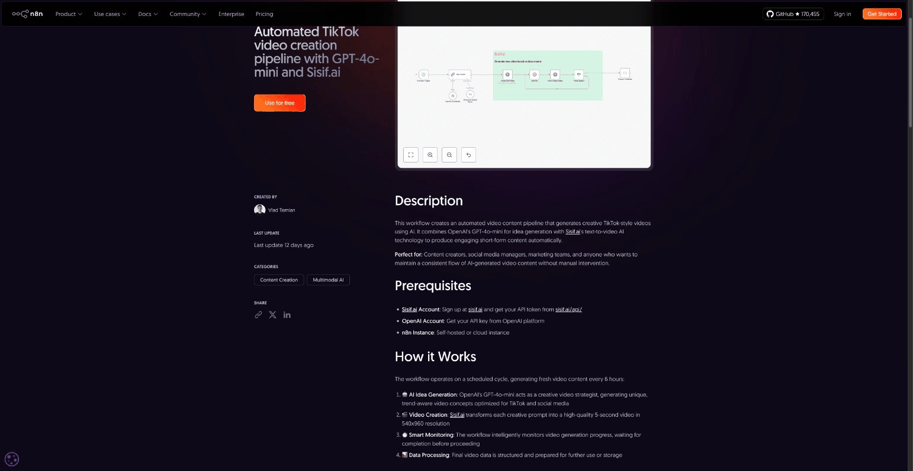

I sold my company in late 2024. After 15 years of building production code, being CTO at QED (acquired by The Sandbox), and working with companies like Gorgias, I had one clear lesson: **product drives value, not technical implementation**.

So I started a side project. Something I could build and ship fast. Something that solves a real problem.

## The Side Project: Sisif.ai

**[sisif.ai](https://sisif.ai)** is an AI video generation API. Text prompt in, video out. Simple.

Most AI video tools are built for clicking around in browsers. But developers want to automate — batch generation, workflow integration, programmatic control. That's the gap I saw.

Three steps: submit a text prompt, receive a webhook when it's done, download your video. Multiple resolutions. Pay per use, no subscription required.

I started building in December 2024 and launched in early 2025. Built it with **SaaS Pegasus**, a Django boilerplate by Cory Zue — who's been building in public since 2017 and runs at a $122/hour effective rate. No AI coding agents for this one. Just good old Django.

## The Marketing Playbook (That Didn't Work)

I did everything the indie hacking playbook says:

- **Twitter/X content** — posted regularly, shared progress
- **ProductHunt launch** — prepared the launch, gathered supporters
- **SEO** — added llms.txt, optimized pages
- **Building in public** — shared the journey

The result?

- **0** paying customers
- **8** followers
- ProductHunt: crickets
- SEO: too early to tell

The harsh reality of indie hacking. Traditional marketing is slow. Twitter takes years to build. ProductHunt is a lottery. SEO needs months to compound.

## The Pivot: Ride Existing Waves

I stopped building from scratch. Instead, I asked: **where are the users already?**

The answer was **n8n** — the workflow automation tool. Thousands of users building automations, looking for integrations. They don't need to find me. I need to be where they already are.

So I built workflows:

- **TikTok video creation pipeline** — GPT-4o-mini for scripts + Sisif.ai for video
- **Instagram Reels automation** — same stack, different output
- Published everything on the n8n creator profile

This is **riding existing waves**. SEO? Write for big sites that already rank. Distribution? Let users find you through tools they already use.

## Pricing Evolution

My first pricing was wrong. **$9/month** single plan. Too cheap, wrong incentives.

I switched to tiered pricing:

- **Alpha Tester**: $10/month (100 tokens)
- **Starter Pack**: $50/month (1,000 tokens)
- **Pro Creator**: $200/month (5,000 tokens)

Higher tiers = higher revenue per customer. The change increased MRR 4x.

## Lessons Learned

After months of building and marketing sisif.ai, here's what stuck:

**Distribution beats product.** Build where users already are. The best product nobody knows about loses to the mediocre product everyone finds.

**Ride existing waves.** n8n, marketplaces, integrations. Don't fight for attention. Go where attention already exists.

**Price for value.** Tiered pricing forces you to think about customer segments. Not everyone needs the same thing. Charge accordingly.

**Traditional marketing is slow.** Twitter/ProductHunt/SEO didn't work yet. Maybe they will. But I needed results now. Existing platforms delivered.

---

Find me at [@vtemian](https://twitter.com/vtemian) or check out [sisif.ai](https://sisif.ai).
