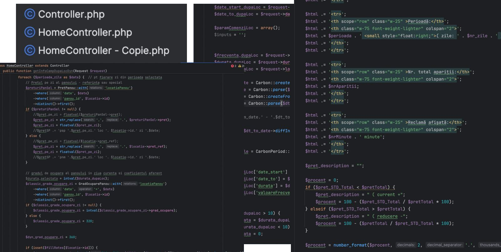

March 17th, 2025. My regular work was done for the day. I had three hours before I needed to stop.

A friend had recommended Claude Code a few days earlier. "Think of it like having a really junior developer on your team." I was skeptical. I'd used Copilot for autocomplete, played with ChatGPT. Wasn't sold on Cursor.

But I had this project. The one everyone has. Making money for years, users depend on it, and every time someone opens the codebase they quietly close their laptop and find something else to do.

So I pointed Claude Code at it. Not because I had to. Not because anyone asked. Just to see if the hype was real.

## The Codebase

An old Laravel app. Controllers weren't controllers. They were novels. One function: **2,000 lines**. Files literally named `HomeController-2.php` and `HomeController - Copie.php`.

Variables in Romanian. Comments in English. Error messages in... who knows. HTML embedded directly in PHP strings. One missing closing tag and the entire page explodes.

The frontend? jQuery callbacks nested so deep you need a map.

No validation. No tests. Deployed via FTP.

I'm not shaming this project. It was adding real value. Making money. Serving users. I'd bet you have at least one codebase exactly like this. **Why fix something that's working, right?**

That's the trap. Technical debt compounds. Every month it sits there, the cost of touching it grows.

## Three Hours

I paid $20 for API tokens. They didn't have subscriptions yet. Set a timer.

**The deployment.** FTP. No containers, no version control for infrastructure, just raw files on a server. I asked Claude to modernize it. Within minutes: Docker setup, docker-compose, environment variables. Something that usually takes an afternoon was done before I finished my coffee.

**The controllers.** That 2,000-line file? Authentication, business logic, database queries, email, PDF generation. All in one beautiful monument to "I'll refactor this later." Claude analyzed the structure, identified boundaries, split it into focused controllers, extracted service classes.

I asked it to translate everything to English. `$prenume_utilizator` became `$userFirstName`. Functions got doc blocks. Type hints appeared everywhere.

**The frontend.** jQuery spaghetti mixed with Blade templates mixed with inline PHP. Started conservative: "Extract this jQuery and add Tailwind." It worked. Then I pushed further: "Convert these to Vue."

The Vue code wasn't perfect. Neither was the Tailwind. We were starting from jQuery callbacks and PHP-embedded HTML. But it worked. It was maintainable.

I stopped after three hours. Looked at what we'd done. Modern dependencies. Running in Docker. Clean architecture. Readable code. **Way faster than before.**

One guy. No designer. No DevOps team. No frontend specialist. **Three hours.**

## What Happened Next

I couldn't unsee it. Every abandoned project, every "we'll fix it later" codebase, every side project I'd shelved because "who has the time?" Suddenly felt possible.

I forked **[gitfs](https://github.com/vtemian/gitfs)**, my oldest fun project. A FUSE filesystem in Python 2.7. No release for 6 years. Fuck it. Fire up Claude. In a week of evenings: Python 3, FUSE 3 support, released on Launchpad for Ubuntu and Debian.

Then new projects started flowing. **[sisif.ai](https://sisif.ai)** for AI video generation. **[cleaninvoices.com](https://cleaninvoices.com)** for invoice processing. **[vatguard.com](https://vatguard.com)** for VAT validation. **[formulare.ai](https://formulare.xyz)** for Romanian form generation. My GitHub graph lit up like a Christmas tree.

## The Catch

You still need to know what you're doing.

Claude didn't replace my judgment. I made every architectural decision. I validated every change. I understood the domain. Someone without Laravel or Docker experience would have gotten plausible-looking garbage.

These tools amplify what you already know. They take the grunt work. The tedious refactoring, the boilerplate, the repetitive transformations. They compress hours into minutes. Solo developers can tackle projects that used to need teams.

That's not hype. That's just math.

---

You have a project gathering dust. You know the one. Too scary to touch, too expensive to rewrite.

Pick it. Set a three-hour timer. See what happens.

Stay curious ☕
