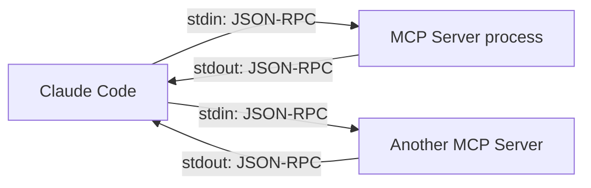
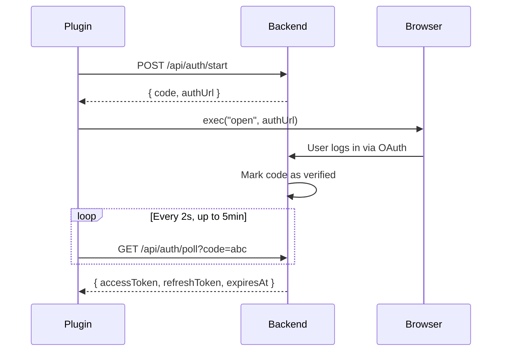
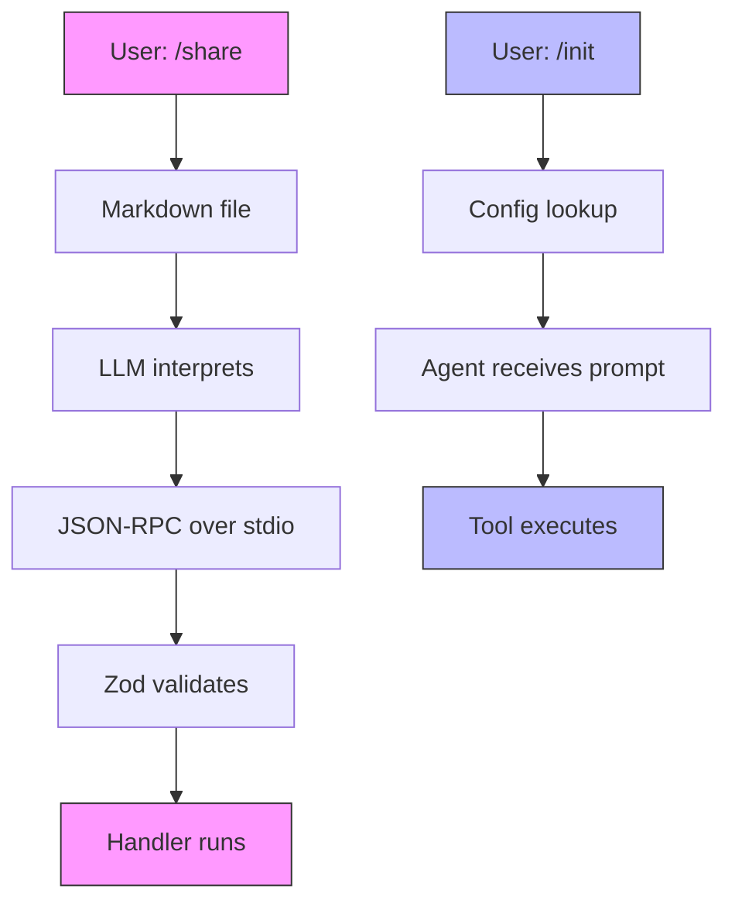

# MCP Is Great for Tools. Terrible for Agents.


I built [Claudebin](https://claudebin.com) because I was tired of losing the "messy middle" of my Claude Code sessions. You debug a race condition, the agent rewrites three files, and the transcript is gone the moment you close the terminal. Claudebin turns those ephemeral sessions into shareable URLs. Run `/claudebin:share`, and you get a permanent link to the exact moment things clicked.

But this post isn't just about the tool. It's about what I learned while building an MCP server from scratch, the hidden frustrations of the JSON-RPC stream, and a fundamental realization: the Model Context Protocol (MCP) is the right model for tools, but it might be the wrong one for agents.

**TL;DR**

- MCP is JSON-RPC 2.0 over stdio. Your plugin is a child process that Claude Code pipes JSON to. Simple, isolated, and language-agnostic.
- Claude Code's slash commands are non-deterministic. A markdown file instructs the LLM to call your tool. The dispatch goes through model reasoning. It works. Usually.
- **The Stdio Trap:** A single `console.log` in an MCP server corrupts the JSON-RPC stream. I spent an hour debugging a "server failure" only to realize my own debug logs were blowing up the pipe.
- Claude Code plugins can't observe, intercept, or modify agent behavior. You get a pipe and a schema. No lifecycle hooks. No shared state.
- OpenCode plugins run in-process with 11+ hooks. The DX is better for complex systems, but the portability is worse.
- **My Verdict:** If you need more than a simple tool, you're fighting the architecture.

## MCP: JSON-RPC 2.0 Over stdio

The [Model Context Protocol](https://modelcontextprotocol.io/) sits on top of JSON-RPC 2.0 <sup><a href="#ref-1">[1]</a></sup>. Claude Code spawns your server as a child process, pipes stdin/stdout, and exchanges newline-delimited JSON <sup><a href="#ref-2">[2]</a></sup>. No HTTP, no WebSockets, no port allocation. One child process per MCP server, lifecycle tied to the parent <sup><a href="#ref-2">[2]</a></sup>.



When Claude Code starts your server, it sends an `initialize` request:

```json
→ {"jsonrpc":"2.0","id":1,"method":"initialize","params":{
    "protocolVersion":"2025-11-25",
    "capabilities":{"roots":{"listChanged":true}},
    "clientInfo":{"name":"claude-code","version":"1.0.0"}}}

← {"jsonrpc":"2.0","id":1,"result":{
    "protocolVersion":"2025-11-25",
    "capabilities":{"tools":{}},
    "serverInfo":{"name":"claudebin","version":"1.0.0"}}}

→ {"jsonrpc":"2.0","method":"notifications/initialized"}
```

Capability negotiation <sup><a href="#ref-3">[3]</a></sup>. The client declares what it supports, the server responds with its own. Claudebin only declares `tools`. The third message is a notification (no `id`, no response expected), signaling the handshake is complete.

Then Claude discovers tools via `tools/list` and invokes them via `tools/call` <sup><a href="#ref-4">[4]</a></sup>. The tool response uses MCP's content block format:

```json
← {"jsonrpc":"2.0","id":3,"result":{
    "content":[{"type":"text","text":"https://claudebin.com/threads/abc123"}]}}
```

MCP separates *protocol errors* (unknown tools, malformed requests, server failures) from *tool errors* (your code ran but failed). Tool errors return a successful response with `isError: true` <sup><a href="#ref-4">[4]</a></sup>. The distinction matters because Claude can reason about tool errors and retry. Protocol errors rarely lead to successful recovery.

One gotcha with the long-lived process model: `console.log` goes to stdout and corrupts the JSON-RPC stream <sup><a href="#ref-2">[2]</a></sup>. This bites every new MCP developer. Use `console.error` for debugging.

## Session Extraction

The genuinely hard part of building Claudebin wasn't the protocol—it was the archaeology. I had to figure out exactly where Claude Code hides its session data and how to extract it without breaking anything.

Sessions live as `.jsonl` files under `~/.claude/projects/`. But the directory names aren't human-readable; they're normalized project paths. I found that `/Users/vlad/projects/my-app` becomes `-Users-vlad-projects-my-app`. Every non-alphanumeric character (including that leading slash) maps to a dash.

I didn't find this in any documentation. I found it by digging through the Claude Code source and verifying it against my own filesystem. One regex, one pass:

```typescript
const normalizeProjectPath = (projectPath: string): string => {
  return projectPath.replace(/[^a-zA-Z0-9]/g, "-");
};
```

Getting this wrong means a silent "session not found" error, which is a terrible user experience. Claudebin has to handle this normalization perfectly to find the right project folder.

Inside, things get even messier:

```
~/.claude/projects/Users-vlad-projects-my-app/
├── default.jsonl          # Main conversation
├── agent-a1b2c3d4.jsonl   # Subagent session (Task tool)
├── agent-e5f6g7h8.jsonl   # Another subagent
```

I had to write logic to filter out those `agent-*` files and pick the most recent one by `mtime`. Each line is a self-contained JSON object. I read the whole file as a UTF-8 string and ship it to the backend.

**The Memory Reality Check:** Node.js strings are UTF-16 internally, so a 50MB session suddenly eats ~100MB of heap. By the time you JSON-serialize the HTTP body, you're hitting a 200MB peak. I considered a streaming upload, but for the typical 5MB session, the complexity wasn't worth the trade-off. I settled on a 50MB client-side safety valve to keep things fast and predictable.

## Device Authorization

MCP servers run in a terminal. No browser window, no OAuth redirect URI. Claudebin uses a pattern similar to RFC 8628 (Device Authorization Grant) <sup><a href="#ref-7">[7]</a></sup>:



The one-time code correlates the CLI and browser session. Tokens are cached in `~/.claudebin/config.json` with `0o600` permissions <sup><a href="#ref-5">[5]</a></sup> (same pattern as `~/.ssh/`). Before every share, claudebin checks the cached token. If it's within 5 minutes of expiry, it refreshes proactively rather than failing mid-upload.

Both auth and session publishing use async polling. Rather than duplicate the retry logic, claudebin has a generic `poll<T>()` with configurable interval, timeout, and a type guard callback. Auth polls for 5 minutes (user might be slow). Session processing polls for 2 minutes. No backoff, fixed 2-second interval. For a single-user CLI tool generating 30 req/min during a poll, this is fine.

Why not WebSockets? Connection lifecycle management, stateful load balancing, maintaining a persistent socket alongside the stdio event loop. The polling implementation is 20 lines. A robust WebSocket client is 200+. For a 5-15 second wait, 2 seconds of overhead is acceptable.

## Two Plugin Models, Two Philosophies

I've also built [micode](https://github.com/vtemian/micode), a plugin for [OpenCode](https://opencode.ai/) with 26 specialized agents. The experience of building for both platforms exposed a fundamental design disagreement about what a "plugin" should be.

In Claude Code, a plugin is a separate process that the LLM talks to over a protocol. In OpenCode, a plugin is code that runs inside the agent runtime. This isn't a minor implementation detail. It shapes everything.



The left chain (pink) is Claude Code: 6 hops. The right chain (blue) is OpenCode: 4 hops.

### Dispatch: Deterministic vs Probabilistic

When you type `/claudebin:share` in Claude Code, the slash command is a markdown file. Claude reads it, interprets the natural language instructions, and *decides* to call the MCP tool. The dispatch goes through model reasoning. It's probabilistic. Claude usually gets it right. Usually.

When you type `/init` in OpenCode, a config object maps the command to an agent:

```typescript
config.command = {
  init: {
    agent: "project-initializer",
    template: `Initialize this project. $ARGUMENTS`,
  },
};
```

String substitution. Hash map lookup. Deterministic. `/init` always routes to `project-initializer`. There is no interpretation step.

For claudebin, a single-tool plugin, this means Claude spends 1-2 seconds reasoning about which tool to call when there's only one option. That's model inference time burned on a decision with exactly one valid answer.

### Hooks: Observing vs Hoping

This is where the gap gets wide. OpenCode plugins have lifecycle hooks. You can intercept and modify behavior at 11+ points: before/after tool execution, on message receive, on context compaction, on permission prompts.

In micode, the `tool.execute.after` hook truncates tool output to stay within context limits. The `chat.params` hook injects project context files before each LLM call. The `experimental.chat.system.transform` hook modifies the system prompt dynamically based on what the agent is doing.

```typescript
return {
  "tool.execute.after": async (input, output) => {
    await tokenAwareTruncation(input, output);
    await artifactAutoIndex(input, output);
  },
  "chat.params": async (input, output) => {
    await injectProjectContext(input, output);
    await loadContinuityLedger(input, output);
  },
};
```

Claude Code plugins can't do any of this. Your MCP server is a black box behind a pipe. You get a request, you return a response. You can't observe what Claude is doing, intercept other tools, modify the system prompt, or react to session events. You can't even know how much context is left.

This matters in practice. Micode tracks file operations across tool calls and auto-indexes artifacts. It detects when context is running low and triggers a ledger dump. It enforces code style patterns by injecting constraints into the system prompt. None of this is possible through MCP. You'd have to rely on Claude's built-in behavior and hope it does the right thing.

### State: Shared vs Isolated

OpenCode plugins share the runtime. Tools access a `ToolContext` with session ID and abort signals. Shared state lives in closures over the plugin scope. One tool can read what another tool wrote. Agents spawn subagents via `spawn_agent`, which creates fresh sessions but receives context explicitly through the prompt.

MCP servers are isolated processes. If two tools need shared state, they go through the filesystem. There's no session context, no abort propagation, no shared memory. Claudebin manages its own auth state in `~/.claudebin/config.json` because there's nowhere else to put it.

For simple tools like claudebin, isolation is fine. You call one function, get one result. But for a system like micode where 26 agents coordinate, spawn subagents in parallel, share continuity ledgers, and track progress across tasks, process isolation would be a straitjacket.

### So Which One Wins?

Neither. They solve different problems.

|                       | MCP (Claude Code)          | Direct Plugin (OpenCode)        |
|-----------------------|----------------------------|---------------------------------|
| Tool dispatch         | LLM inference              | Hash map lookup                 |
| Lifecycle hooks       | None                       | 11+ hook points                 |
| State sharing         | Filesystem only            | In-process context              |
| Language support      | Any (JSON-RPC over stdio)  | JS/TS only (Bun runtime)       |
| Process isolation     | Yes                        | No                              |
| Portability           | Claude Code, Cursor, Zed   | OpenCode only                   |
| Agent orchestration   | Single agent, sequential   | Multi-agent, parallel spawning  |

MCP is the right model for tools. Standalone utilities that do one thing, work across editors, and benefit from isolation. A hotel scraper, a session sharer, a code search engine. Write it in any language, ship it everywhere.

OpenCode's model is the right one for agent systems. When you need hooks, state, parallel agents, deterministic routing, and deep integration with the runtime. When the plugin isn't a utility but a workflow engine.

The problem is that Claude Code only offers MCP. If you want to build anything beyond a simple tool, you're fighting the architecture. You can't observe, you can't intercept, you can't orchestrate. You get a pipe and a JSON schema.

OpenCode only offers direct plugins. If you want a Python tool, you're wrapping it in a subprocess yourself. If you want cross-editor portability, you're out of luck.

The ideal platform would offer both. MCP for portable tools, direct plugins for deep integration. Neither does that today.

The code is at [github.com/wunderlabs-dev/claudebin](https://github.com/wunderlabs-dev/claudebin).

Stay curious ☕

---

### References

<div class="references">

<p id="ref-1"><span class="ref-num">[1]</span> JSON-RPC 2.0 Specification - <a href="https://www.jsonrpc.org/specification">jsonrpc.org/specification</a></p>

<p id="ref-2"><span class="ref-num">[2]</span> MCP Specification: Transports - <a href="https://modelcontextprotocol.io/specification/2025-11-25/basic/transports">modelcontextprotocol.io/specification/2025-11-25/basic/transports</a></p>

<p id="ref-3"><span class="ref-num">[3]</span> MCP Specification: Lifecycle - <a href="https://modelcontextprotocol.io/specification/2025-11-25/basic/lifecycle">modelcontextprotocol.io/specification/2025-11-25/basic/lifecycle</a></p>

<p id="ref-4"><span class="ref-num">[4]</span> MCP Specification: Tools - <a href="https://modelcontextprotocol.io/specification/2025-11-25/server/tools">modelcontextprotocol.io/specification/2025-11-25/server/tools</a></p>

<p id="ref-5"><span class="ref-num">[5]</span> Claudebin source code - <a href="https://github.com/wunderlabs-dev/claudebin">github.com/wunderlabs-dev/claudebin</a></p>

<p id="ref-6"><span class="ref-num">[6]</span> JavaScript's internal character encoding: UCS-2 or UTF-16? - <a href="https://mathiasbynens.be/notes/javascript-encoding">mathiasbynens.be/notes/javascript-encoding</a></p>

<p id="ref-7"><span class="ref-num">[7]</span> RFC 8628: OAuth 2.0 Device Authorization Grant - <a href="https://datatracker.ietf.org/doc/html/rfc8628">datatracker.ietf.org/doc/html/rfc8628</a></p>

</div>

