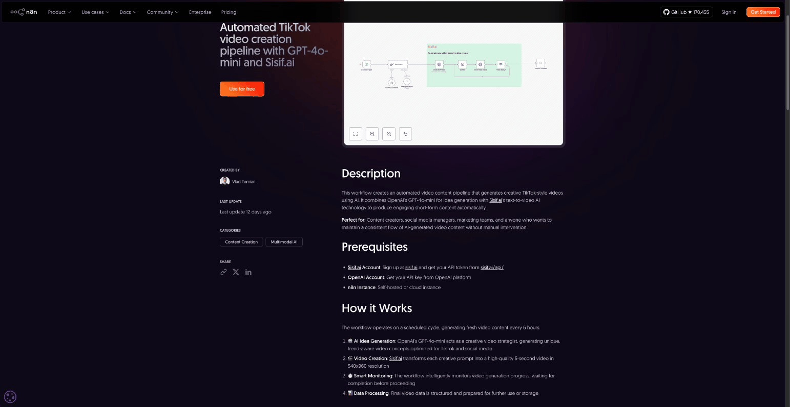
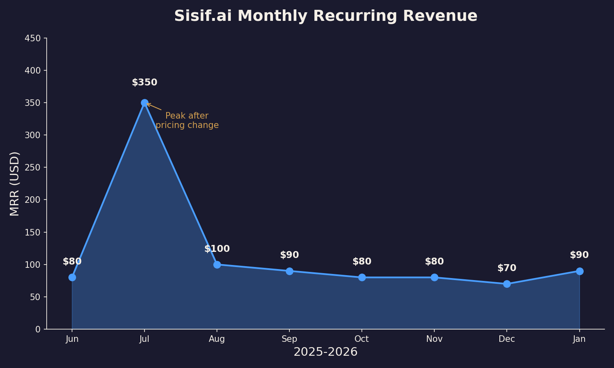

# Riding Existing Waves: My Indie Hacking Journey with Sisif.ai

After 15 years of building production infrastructure—including a stint as CTO at QED (acquired by The Sandbox)—I thought I knew how to build a product. I was wrong. I knew how to build *systems*, but I had zero idea how to build *distribution*.

This talk is the story of **sisif.ai**, and how I had to unlearn everything about being a CTO to find my first paying customers.

## The CTO's Unlearning: Distribution > Technicality

Coming from a high-scale engineering background, my instinct was to "over-build." I wanted clean code, perfect infrastructure, and a robust CI/CD pipeline. But in the world of indie hacking, **nobody cares about your unit test coverage if you have zero customers.**

I had to shift my mindset from **Technical-First** to **Distribution-First**. My "CTO brain" told me to optimize the video rendering engine; my "Founder brain" told me to find a way to get the product in front of people who were already looking for it. 

The lesson: **Distribution is the only feature that matters when you're at zero.**

## The Marketing Playbook (That Didn't Work)
...
I did everything the indie hacking playbook says:

- **Twitter/X content** — posted regularly, shared progress
- **ProductHunt launch** — prepared the launch, gathered supporters
- **SEO** — added llms.txt, optimized pages
- **Building in public** — shared the journey

The result?

- **0** paying customers
- **8** followers
- ProductHunt: crickets
- SEO: too early to tell

### Two Months of Twitter: A Reality Check

I committed to **two months of consistent Twitter posting**. Daily updates. Progress screenshots. Building in public threads. Engagement with other indie hackers. The kind of content that supposedly builds audiences.

After 60 days: **8 followers**. Not 8,000. Eight. Most of them were bots or other indie hackers doing the same thing. Zero customers came from Twitter. Zero meaningful conversations. Zero inbound interest.

The accounts that "blow up" on Twitter? They either got lucky with timing, had an existing audience from somewhere else, or have been grinding for years. There's no shortcut. And for a solo founder with a product to ship, spending 2+ hours daily on tweets that reach nobody is a terrible ROI.

### The ProductHunt Launch That Wasn't

I prepared a proper ProductHunt launch. Lined up supporters. Created assets. Picked a launch day. Did everything the guides recommend.

Launch day came. And... nothing. No traction. No upvotes from strangers. The supporters I gathered weren't enough to break through. ProductHunt's algorithm buried the launch before it had a chance.

Here's what I learned: **ProductHunt is a lottery**. The winners are either products with existing audiences (who bring their own traffic) or products that get lucky with the algorithm. For a new product from an unknown founder? The odds are stacked against you.

The harsh reality of indie hacking. Traditional marketing is slow. Twitter takes years to build. ProductHunt is a lottery. SEO needs months to compound.

## The Pivot: Ride Existing Waves

I stopped building from scratch. Instead, I asked: **where are the users already?**

The answer was **n8n** — the workflow automation tool. Thousands of users building automations, looking for integrations. They don't need to find me. I need to be where they already are.

### The n8n Strategy

I published **2 workflow templates** on the n8n creator hub:

1. **TikTok video creation pipeline** — GPT-4o-mini generates the script, Sisif.ai creates the video, posts automatically
2. **Instagram Reels automation** — same stack, different output format

## Platform-Led Growth: The "External SEO" Play

The **n8n template strategy** was my breakthrough. Instead of waiting for Google to index a new domain, I used **Platform-Led Growth (PLG)**.

I published workflow templates on the n8n creator hub that solved specific problems: TikTok automation and Instagram Reels. This isn't just distribution; it's **External SEO**. n8n already ranks for these keywords. By placing my product *inside* their marketplace, I bypassed the "Google Sandbox" period and started getting thousands of views overnight.

This is the **"Ride Existing Waves"** philosophy in practice. Instead of building an audience from zero, you tap into established ecosystems where your users are already looking for solutions.

...
These aren't vanity metrics. n8n users are exactly my target audience: developers and technical founders who want to automate video creation. They're already in a buying mindset — they're looking for tools to plug into their workflows.

The conversion funnel is simple: user discovers template → tries it → needs API access → signs up for Sisif.ai. No cold outreach. No content calendar. No algorithm to game.

### Why This Works

This is **riding existing waves**. Instead of building an audience from zero, you tap into platforms where your users already hang out:

- **n8n** has thousands of users searching for workflow integrations
- **Zapier** and **Make** have similar marketplaces
- **GitHub** templates get discovered organically

SEO? Write for big sites that already rank. Distribution? Let users find you through tools they already use. The math is simple: it's easier to capture 0.1% of 100,000 users than to build 100 users from scratch.

## Pricing Evolution

My first pricing was wrong. **$9/month** single plan. Too cheap, wrong incentives.

I switched to tiered pricing:

- **Alpha Tester**: $10/month (100 tokens)
- **Starter Pack**: $50/month (1,000 tokens)
- **Pro Creator**: $200/month (5,000 tokens)

Higher tiers = higher revenue per customer. The change increased MRR 4x.

## Lessons Learned

After months of building and marketing sisif.ai, here's what stuck:

**Distribution beats product.** Build where users already are. The best product nobody knows about loses to the mediocre product everyone finds.

**Ride existing waves.** n8n, marketplaces, integrations. Don't fight for attention. Go where attention already exists.

**Price for value.** Tiered pricing forces you to think about customer segments. Not everyone needs the same thing. Charge accordingly.

**Traditional marketing is slow.** Twitter/ProductHunt/SEO didn't work yet. Maybe they will. But I needed results now. Existing platforms delivered.

---

Find me at [@vtemian](https://twitter.com/vtemian) or check out [sisif.ai](https://sisif.ai).

