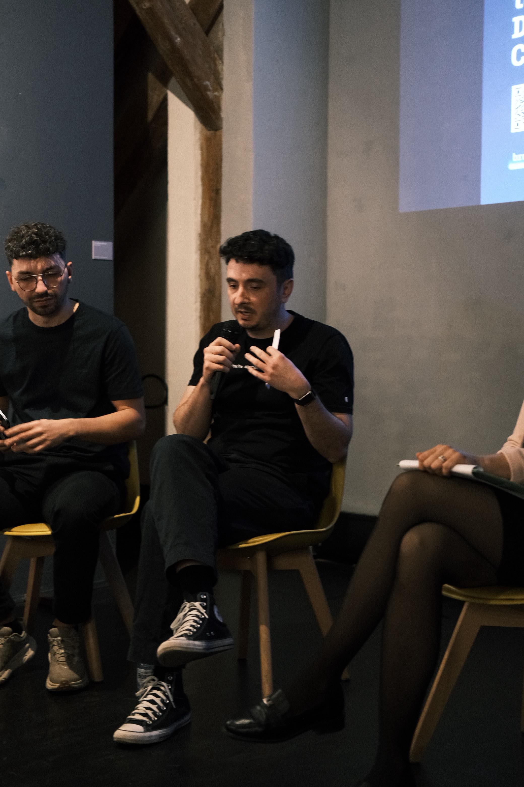
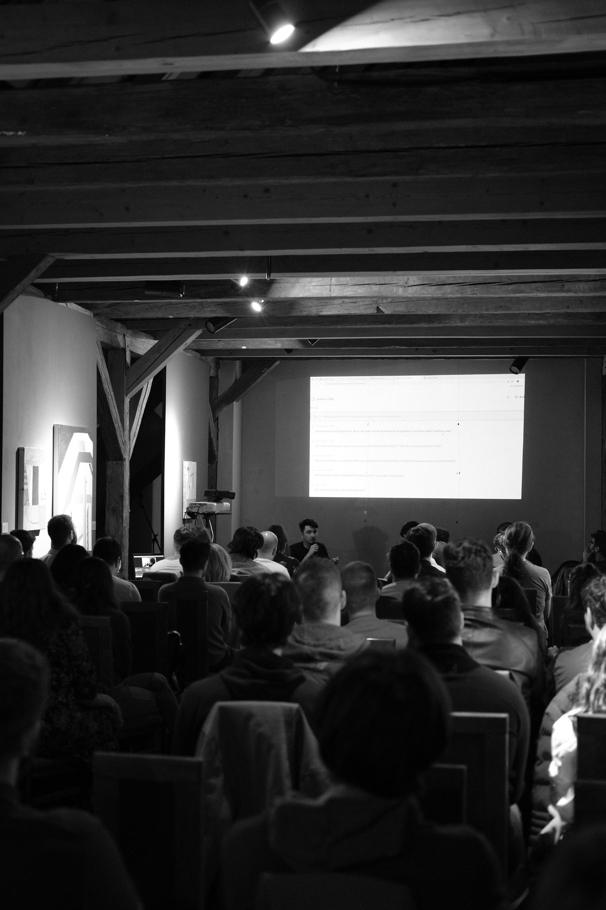

# Why I Think Software Development Will Be Automated by 2030

Last night I debated "Will AI fully automate the Software Development Life Cycle by 2030?" at [All-Stack Hangout](https://luma.com/hl1u9s3a) in Timisoara, organized by [Victory Square Partners](https://www.linkedin.com/company/victorysquarepartners/). I was on the PRO side, alongside [Alexandru Binzar](https://www.linkedin.com/in/alexbinzar/) (CEO, Hibyte). Against us: [Cristian Toma](https://www.linkedin.com/in/tomacristian/) (20-year software engineer) and [Marius Balaj](https://www.linkedin.com/in/marius-balaj/) (UI engineer turned founder). Lavinia Cioloca moderated.

What started as a structured debate turned into a real conversation. This post is my case, expanded and fact-checked.

**TL;DR**

- AI models are improving on two axes simultaneously: pre-training and reinforcement learning. The rate is accelerating, not plateauing.
- The real shift isn't "AI generates code." It's that AI learns to *choose* between tools, patterns, and architectures. That capability generalizes across the entire SDLC.
- Products like Lovable and Base44 prove the concept at scale. They're version 1.
- The finish line is the closed bugfix loop: detect, diagnose, fix, test, deploy. Pieces of it exist today.
- The honest answer: we're closer than most people think, but "fully automated" requires workflow integration that hasn't been built yet.

## Why AI Keeps Getting Better

If you've used AI coding tools in the past year, you've probably noticed: they keep getting better. They "feel" like they understand what you want. You fight them less. This isn't just an impression.

Until recently, models improved primarily by learning from text. Reading the entire internet, all the code, all the documentation. That still works. But since September 2024, when OpenAI launched o1, a second path opened up: reinforcement learning (RL). Models learn by doing. They receive a task, attempt it, get feedback, learn from mistakes, and try again. Exactly how a human learns, except thousands of times faster.

The two paths compound. It's not one or the other. It's both at the same time.

Dario Amodei (CEO, Anthropic) confirmed this on the Dwarkesh Patel podcast in February 2026: "We're seeing the same scaling in RL that we saw for pre-training" <a href="#ref-1">[1]</a>. Every major lab (Anthropic, Google, DeepSeek) has demonstrated the same thing.

The numbers back this up:

| Metric | Then | Now | Source |
|--------|------|-----|--------|
| SWE-bench Verified (real GitHub bugs) | ~4% (early 2024) | 80.9% (Claude 4.5 Opus) | swebench.com <a href="#ref-2">[2]</a> |
| Autonomous task duration (METR) | ~1 hour (2025) | ~5 hours, doubling every 4 months | metr.org <a href="#ref-3">[3]</a> |
| HumanEval (code generation) | 67% (GPT-4, 2023) | 99% (saturated) | EvalPlus <a href="#ref-4">[4]</a> |

METR's time horizon data is particularly striking. If the doubling rate holds, by 2028 we're talking about week-long autonomous tasks. I'm not saying that's guaranteed. I'm saying the data shows no sign of slowing down.

## Tool Usage: The Real Shift

When someone says "AI writes code," yes, it writes code. But that's 2024 thinking. The interesting part is that it's started to *choose*.

Give it a problem and it doesn't just produce a solution. It chooses between options. Which API fits better. What data structure makes sense. Which database is right for your use case. You've probably experienced this yourself: you work with a model and it "understands" what you want. It doesn't just execute. It reasons about the right approach.

This generalizes. The same capability that picks the right API for a feature can pick the right deployment strategy, the right test framework, the right monitoring setup. It's not magic. It's the same skill applied in different contexts.

A concrete example: Rakuten engineers gave an AI agent a task on vLLM, a codebase of 12.5 million lines (Python, C++, CUDA). The agent completed it autonomously in 7 hours with 99.9% numerical accuracy <a href="#ref-5">[5]</a>. A task that would take an experienced engineer days. It didn't generate code from nothing. It understood which tools and patterns to use in the context of a massive existing project.

I see the SDLC as 6 separate problems: planning, implementation, testing, review, deployment, monitoring. And what I observe is that AI is learning to tackle each one.

## Proof at Scale: Lovable and Base44

Two examples that show this isn't theoretical.

**Lovable** takes a sentence in natural language and delivers a working application. Frontend, backend, database, deployment. 8 million users. Over 100,000 new projects every day <a href="#ref-6">[6]</a>.

**Base44** has an even better story. A single founder, from Israel, bootstrapped, no investors. In 6 months: 5 million applications created by users <a href="#ref-7">[7]</a>.

What's interesting is that they solve the same problem for different audiences. Lovable is for developers: editable code, React, Supabase. Base44 is for non-technical users: you never see a line of code. Two completely different products, same underlying capability: take what the user wants and transform it into a working application.

Neither can build a banking system with compliance and audit trails. They're honest about their limitations. But they're version 1, with one year of existence.

## The SDLC, Phase by Phase

Let's look at where we actually stand.

**Planning.** AI already takes requirements and breaks them into technical tasks. Google confirmed that over 30% of their new code is AI-generated <a href="#ref-8">[8]</a>.

**Implementation.** Over 80% on benchmarks. A peer-reviewed study showed developers with AI are 56% faster on coding tasks <a href="#ref-9">[9]</a>. 84% of developers use or plan to use AI tools. 51% use them daily <a href="#ref-10">[10]</a>.

**Testing and Code Review.** AI already writes tests, already catches bugs in review. Not perfect, but useful enough for daily use.

**Deployment.** CI/CD has been automated for years. The difference now is that AI can configure the pipeline from scratch, not just run it.

**Monitoring and Bugfix.** This is the piece that matters most, and it's not fully solved yet.

Think about what happens today when something breaks in production. You get an alert at 3 AM. You open logs. You try to understand what happened. You write a fix. You test it. You send it for review. You deploy it. Hours. Sometimes days.

Now imagine the closed loop: AI detects the anomaly, traces the root cause through logs and metrics, generates the fix, runs tests, and if everything is green, deploys automatically. Without waking anyone at 3 AM.

Not all of this loop exists today. But pieces of it do. And each piece is improving.

I know some will say: "but if you chain 6 automated phases, errors compound." It's a valid point. But that's exactly the problem CI/CD already solves, with feedback loops, quality gates, and automatic rollbacks. It's not a new concept. We're just applying it at a larger scale.

When the bugfix loop closes, the SDLC runs without human intervention. That's the finish line. And we're closer than most people think.

## What I Actually Believe

I don't think the SDLC will be "fully automated" in the sense that zero humans are involved. I think by 2030, a human will describe what they want, and an AI system will deliver working code to production without the human manually writing, reading, or approving code at each step. The human's role shifts from executor to director.

Some argue that the gap between "massive automation" and "complete automation" is a difference of nature, not degree. I think it's a difference of time.

In 2022, AI couldn't write a correct function. In 2024, it could build features. In 2026, it delivers complete prototypes. Not production systems, not yet. I'm honest about that. But look at the velocity.

The question isn't whether the SDLC gets automated. It's whether 4 years is enough.

I'd bet on less.

Stay curious ☕

---

[1] Dario Amodei on Dwarkesh Patel podcast, February 2026. [dwarkesh.com/p/dario-amodei-2](https://www.dwarkesh.com/p/dario-amodei-2)

[2] SWE-bench Verified leaderboard. [swebench.com](https://www.swebench.com/)

[3] METR Time Horizons 1.1, January 2026. [metr.org/time-horizons](https://metr.org/time-horizons/)

[4] EvalPlus HumanEval leaderboard. [evalplus.github.io/leaderboard.html](https://evalplus.github.io/leaderboard.html)

[5] Rakuten + Claude Code case study, Anthropic 2026 Agentic Coding Trends Report. [claude.com/customers/rakuten](https://claude.com/customers/rakuten)

[6] Lovable stats. [techcrunch.com](https://techcrunch.com/2026/03/11/lovable-says-it-added-100m-in-revenue-last-month-alone-with-just-146-employees/)

[7] Base44 acquisition by Wix. [techcrunch.com](https://techcrunch.com/2025/06/18/6-month-old-solo-owned-vibe-coder-base44-sells-to-wix-for-80m-cash/)

[8] Sundar Pichai, Google Q1 2025 earnings call. [fortune.com](https://fortune.com/2024/10/30/googles-code-ai-sundar-pichai/)

[9] Peng et al. (2023), "The Impact of AI on Developer Productivity." [arxiv.org/abs/2302.06590](https://arxiv.org/abs/2302.06590)

[10] Stack Overflow 2025 Developer Survey. [survey.stackoverflow.co/2025/ai](https://survey.stackoverflow.co/2025/ai/)

