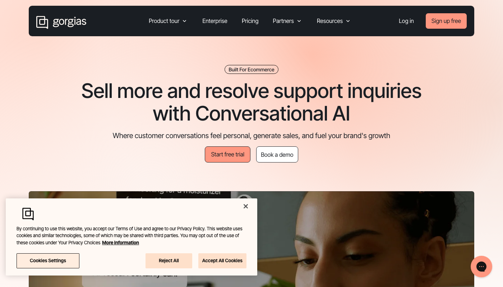
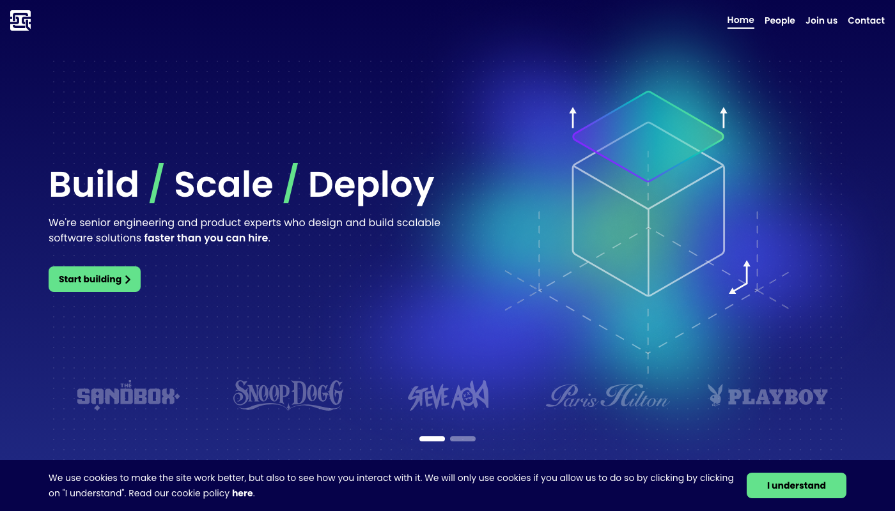
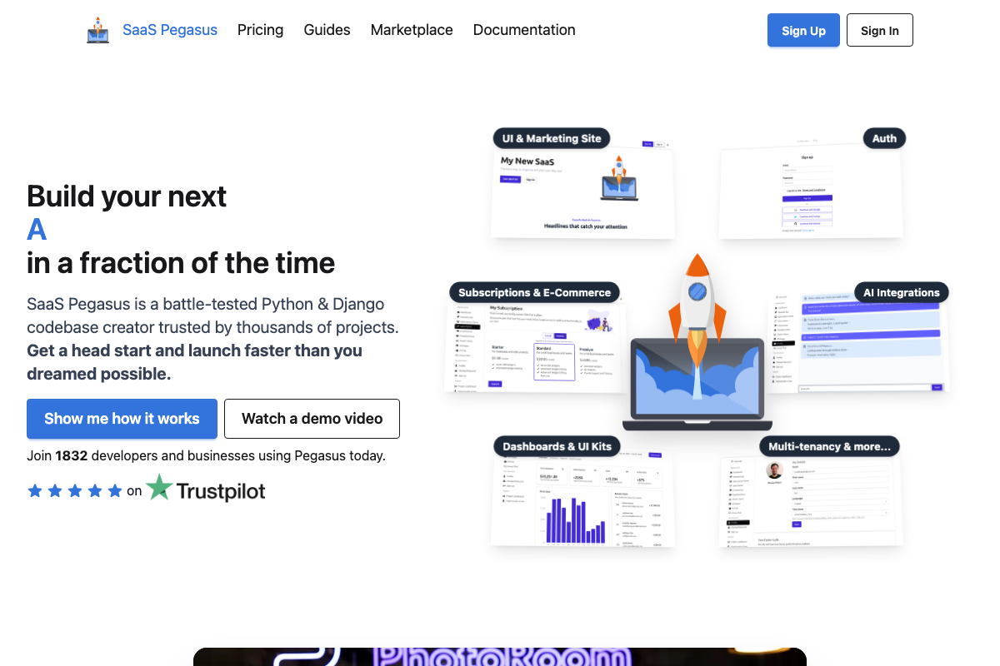
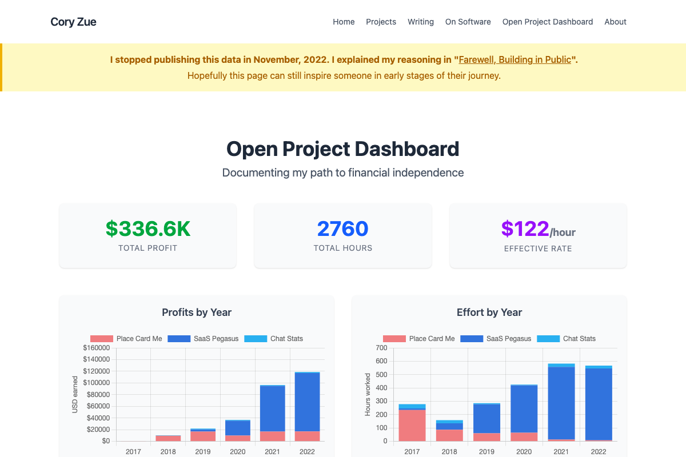
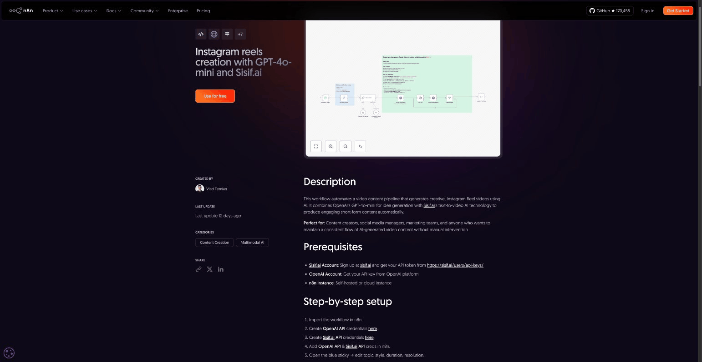
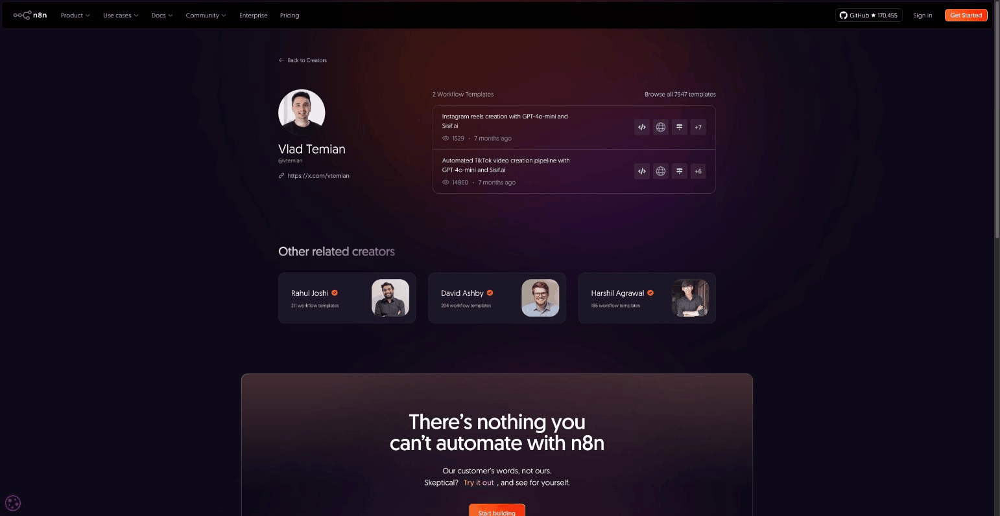
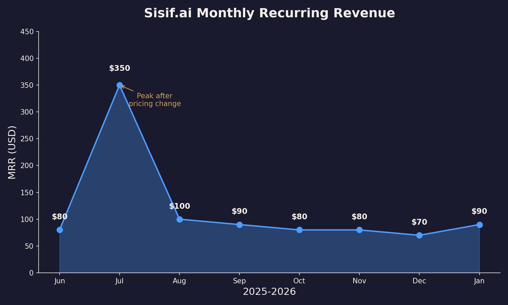

# Indie TM #2

Vlad Temian
@vtemian

---

## About Me

* 15 years building production code
* Former CTO @ **qed.builders**
  (acquired by The Sandbox)
* Love building
* Love people who love building

---

## Background

Python → Web3 → **Agentic.tm**

---

## Background

Python → Web3 → **Agentic.tm**
Lesson from **Gorgias**: product drives value

---

## Background

Python → Web3 → **Agentic.tm**
Lesson from **Gorgias**: product drives value
Co-founded **QED** (20 people) → sold 2024

---

## The Side Project

**sisif.ai** — An AI video generation API

---

## Building Sisif

Started **Dec 2024** → Launched **2025**

No AI coding agents

Built with **SaaS Pegasus** (Django boilerplate)

---

## Cory Zue

Creator of SaaS Pegasus

**$336K** profit, **$122/hour** effective rate

Building in public since 2017

---

## Marketing & Distribution

- Twitter/X content
- ProductHunt launch
- SEO (llms.txt)
- Building in public

---

## Nothing Worked

- **0** paying customers
- **8** followers
- ProductHunt: crickets
- SEO: too early to tell

The harsh reality of indie hacking.

---

## New Idea: Ride Existing Waves

Stop building from scratch.

**SEO**: Write for big sites, offer free backlinks

**Distribution**: Let users find you through tools they already use

---

## n8n: TikTok Workflow

Automated TikTok video creation pipeline

GPT-4o-mini + Sisif.ai

---

## n8n: Instagram Workflow

Instagram Reels creation

GPT-4o-mini + Sisif.ai

---

## n8n: Creator Profile

Published workflows on n8n.io

---

## Pricing Evolution

From **$9/month** single plan to tiered pricing:

- **Alpha Tester**: $10/month (100 tokens)
- **Starter Pack**: $50/month (1,000 tokens)
- **Pro Creator**: $200/month (5,000 tokens)

Higher tiers = higher revenue per customer

---

---

## Lessons Learned

- **Distribution beats product** — build where users already are
- **Ride existing waves** — n8n, marketplaces, integrations
- **Price for value** — tiered pricing increased MRR 4x
- **Traditional marketing is slow** — Twitter/ProductHunt/SEO didn't work (yet)

---

<!-- _class: quote -->

> sisif.ai

---

## Thanks

@vtemian
blog.vtemian.com
sisif.ai
